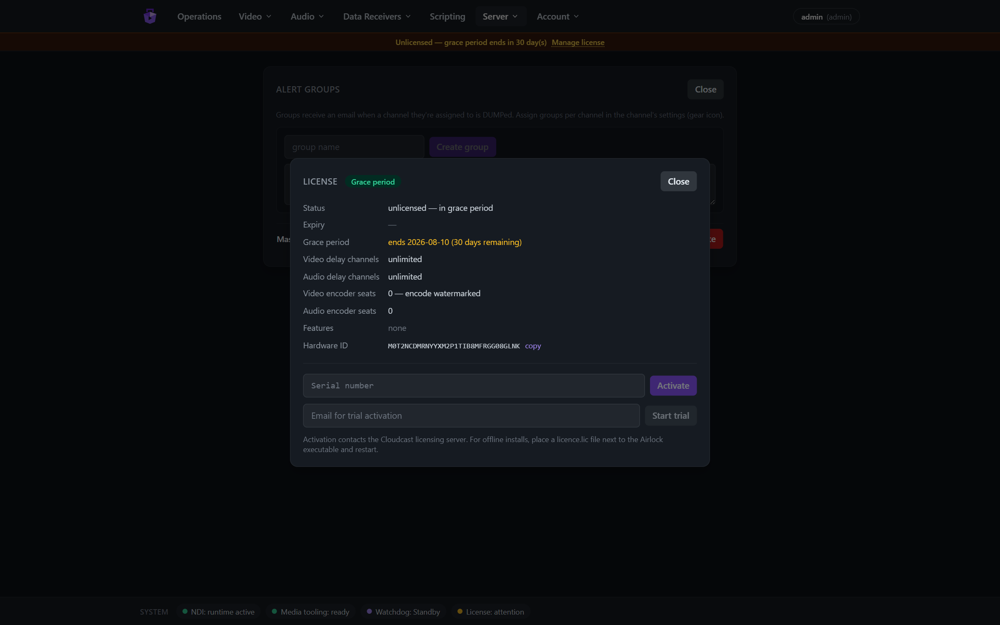

# Airlock User Manual

**Airlock** is a broadcast delay server. It receives a live programme feed over
NDI, buffers it for a configurable delay window, and re-transmits it — giving
master control a window in which offending content can be **dumped** before it
goes to air. Alongside the video delay it provides audio-only profanity delay
channels (ASIO/ALSA hardware), SCTE ad-break triggering, an optional SRT/H.264
contribution encoder with audio processing, Axia Livewire GPIO panel
integration, delayed data routing, alerting, primary/backup redundancy, and a
runtime scripting engine — all managed from a web console.

This manual covers day-to-day operation and administration. For deployment
architecture and design rationale see `docs/` in the source tree; for the
scripting API see [docs/scripting-guide.md](../scripting-guide.md).

---

## Contents

1. [Core concepts](#1-core-concepts)
2. [Getting started](#2-getting-started)
3. [Operations dashboard and the Video console](#3-operations-dashboard-and-the-video-console)
4. [Operating the delay](#4-operating-the-delay)
5. [Channel configuration](#5-channel-configuration)
6. [DUMP alerts, clips and alert groups](#6-dump-alerts-clips-and-alert-groups)
7. [Fill assets](#7-fill-assets)
8. [The encode option (SRT/SCTE-35)](#8-the-encode-option-srtscte-35)
9. [Audio profanity delay](#9-audio-profanity-delay)
10. [Axia Livewire GPIO](#10-axia-livewire-gpio)
11. [Data receivers and delayed data](#11-data-receivers-and-delayed-data)
12. [Scripting](#12-scripting)
13. [Server administration](#13-server-administration)
14. [Licensing](#14-licensing)
15. [Remote control: TCP protocol and REST](#15-remote-control-tcp-protocol-and-rest)
16. [Roles and permissions](#16-roles-and-permissions)
17. [Alarms and troubleshooting](#17-alarms-and-troubleshooting)

---

## 1. Core concepts

A **channel** is one delay path. Channels come in two kinds:

- **Video channels** receive an NDI source (`<source> → Airlock <name>`) and
  re-send it, delayed, under the NDI name `Airlock <name>`.
- **Audio channels** are profanity delays on a sound-card pair (ASIO on
  Windows — e.g. the Axia IP-Audio driver — or ALSA on Linux), covered in
  [§9](#9-audio-profanity-delay).

A video channel is always in one of four states:

| State | Badge colour | Meaning |
|---|---|---|
| **Live** | green | Straight-through relay; no delay in the path. |
| **Building** | amber | The **fill** is playing to air while the delay buffer records the live feed. |
| **Delayed** | blue | Programme airs behind live by the buffer depth. The protection window is open. |
| **RollingOut** | orange | The delay is unwinding back to live. |

The transitions are driven by three transport commands:

- **Build** — start delaying. Airlock plays the channel's fill (or freezes the
  last live frame) while the buffer fills to the configured window.
- **Roll out** — return to live. The buffered content drains and the return to
  live ends in a deliberate **forward jump cut** — content received while the
  buffer drains is discarded (accepted design AIR-7).
- **Dump** — the protection action. The buffer is flushed so the offending
  content **never airs**; a reviewable **dump clip** is written and alert
  emails go out. Audio is faded at the flush so nothing clicks on air.

Two behaviours worth knowing before you operate:

- **Source loss**: if the input NDI feed disappears, the output does not stop —
  Airlock self-paces and **holds the last good frame** (raising
  `ALARM_SOURCE_LOST`) so downstream receivers never unlock, and resumes
  cleanly when the source returns.
- **Watermarking, not blocking**: channels that don't hold a licence seat
  still run, but their output is watermarked ([§14](#14-licensing)) — burnt-in
  video marks plus periodic audio tones. ROLLOUT and DUMP are never gated;
  they are always allowed as exits.

## 2. Getting started

### Requirements

- The **NDI runtime** on the server (without it the server runs in ENGINE-SIM,
  a synthetic demo mode; the footer shows which).
- **ffmpeg/ffprobe** for fill conforming, previews and dump-clip transcoding
  (`FFPROBE_PATH` / `FFMPEG_PATH` if not on PATH; the footer and the Fills page
  warn when missing).
- A disciplined host clock (NTP/PTP) — audit timestamps and outgoing timecode
  depend on it.

### Installing

On Windows, the MSI installer sets Airlock up as a **Windows service**: the
installer asks for the web console port (default **8080**; unattended installs
can pass `WEBPORT=n` to `msiexec /qn`), opens firewall rules for that port and
for TCP control (9350), and anchors the database and logs to
`%ProgramData%\Airlock`. Development/console runs (`dotnet run`) serve on
`http://localhost:5000` by default and keep their data beside the executable
unless `--DataDir` says otherwise.

### First sign-in

Open the console (`http://<server>:<port>`). On first boot, when no users
exist, Airlock creates the bootstrap account **`admin` / `airlock-change-me`**
(also logged loudly at startup and audited). Sign in and change it immediately
via **Account → Change password**.


Sign-in is rate-limited to 5 attempts per minute per IP. When LDAP or OIDC SSO
is configured ([§13.2](#132-external-authentication--ldap--oidc)), directory
accounts sign in on this same form (LDAP) or via the SSO button; the internal
login always remains available as break-glass.

### The console at a glance

- **Top navigation**:
  - *Operations* — the view-only dashboard over everything ([§3](#3-operations-dashboard-and-the-video-console));
  - *Video* — **Delay channels** (the video console), **Encoders**, **Fills**,
    **Dump clips**;
  - *Audio* — **Delay channels**, **Fills & schedules**, **Censor schedules**;
  - *Data Receivers* — TCP Servers, TCP Clients, UDP Servers, Routing,
    Axia GPIO;
  - *Scripting* (admin);
  - *Server* (admin) — **Settings & SMTP**, **Alert groups**, **License**,
    **Redundancy**;
  - *Account* — Change password, Sign out.
- **Banners** (under the header): an amber/red **licence** banner while the
  licence needs attention (admins get a *Manage license* link); an amber/red
  **redundancy** banner on a backup that has lost its master (or been taken
  over); a sky-blue note on a synced backup — *"Backup — configuration and
  controls are managed by the master at <host>"* ([§13.6](#136-redundancy-primarybackup)).
- **Footer status pills**: NDI runtime, media tooling (ffmpeg), watchdog
  state, licence state — plus a **Redundancy** pill (`Redundancy: primary` /
  `Redundancy: backup Synced` …) when a redundancy role is configured.

Live numbers (meters, depth, states, encoder stats) stream over a single
binary WebSocket at ~10 Hz, so what you see is effectively real time.

## 3. Operations dashboard and the Video console

### Operations — the view-only dashboard

**Operations** is a read-only overview of the whole server — nothing on it
changes state. It is banded into **Input / output video** (one tile per video
channel: state badge, source line, input/output previews, meters, compact
Depth/Drops/Holds counters, alarm strip), **Encoder video** (one tile per
enabled encoder with its live preview and stats), **Audio** (one tile per
audio channel with its depth bar and meters) and **Audit** (the latest 25
audit rows, refreshed every 3 s — every command from every interface lands
here). Clicking any tile jumps to the owning control page and highlights the
card.


### Video → Delay channels — the video console

The control surface lives on **Video → Delay channels**: the full channel
cards with transport buttons, plus the admin **+ Add channel** control in the
page header.


Reading a card, top to bottom:

- **Header** — channel name; engine badge (`NDI delay engine`, or `engine-sim`
  without the NDI runtime); the licence-seat pill (`licensed`, or an amber
  **UNLICENSED** button — see [§14](#14-licensing)); the **state badge**; the
  **Encode** pill ([§8](#8-the-encode-option-srtscte-35)); the **sliders icon**
  that opens audio processing ([§5](#5-channel-configuration)); and the gear
  that opens channel settings.
- **Source line** — `<NDI source> → Airlock <name> · fill: <fill name>`.
- **Confidence monitors** — Input and Output previews (~5 fps). The output
  preview shows *what actually airs*, including any watermark. In Delayed the
  output header reads **"Output — delayed N.Ns"**.
- **Audio meters** — L/R RMS bars with peak-hold, −60…0 dBFS, turning amber at
  −9 and red at −3.
- **Monitor input / Monitor output** — click to listen in the browser (Opus
  over WebSocket; needs a WebCodecs browser — Chrome/Edge/Safari 16.4+). One
  audible tap per channel; a green **MONITORING** tag and a volume slider
  appear while live:

  

- **Counters** — `Depth` (frames and seconds), `In`/`Out` frame counts,
  `Drops` (red when non-zero), `Holds` (hold-last-frame repeats), `SCTE`
  (splices inserted).
- **Alarm strip** — active alarms in red, e.g. `ALARM_SOURCE_LOST`
  ([§17](#17-alarms-and-troubleshooting)).
- **Transport buttons** — Build / Roll out / Dump / Trigger ad break
  ([§4](#4-operating-the-delay)).

### Adding, disabling and deleting channels (admin)

Click **+ Add channel** in the *Video delay channels* header, type a name (max
24 characters) and pick the kind — **video delay** or **audio delay**. Enter
submits, Esc cancels. Audio channels appear under Audio → Delay channels.


Disabling a channel (gear → **Disable channel**) stops it and releases its
frame pool, engine and NDI receiver; the card collapses to a dimmed stub with
**Enable** and **Delete** buttons (a dimmed tile also shows on Operations).
Deletion is only possible while disabled and removes the channel's GPIO
mappings, schedules and data routes with it.

## 4. Operating the delay

All transport commands live on **Video → Delay channels** (the Operations
dashboard is view-only).

### Build

**Build** is enabled only while **Live**. Press it and:

- the output switches to the channel's **fill** (or freezes the last live
  frame in freeze mode) while the buffer records the live feed;
- the state badge turns amber (**Building**) and the depth counter climbs;
- when the delay window is reached, the channel drops into **Delayed** and the
  programme airs behind live.


The delay window depends on the delay mode: with **Delay to asset** it is the
fill's full length; with **Delay to time** it is a fixed window
([§5](#5-channel-configuration)).

### Delayed — the protection window


In **Delayed** the operator can:

- **Dump** — flush the buffer. A confirmation dialog (*"DUMP <name>? The
  buffer flushes and the channel returns to live."*) guards the button. The
  flushed content is written as a dump clip and alert-group emails go out
  ([§6](#6-dump-alerts-clips-and-alert-groups)).
- **Roll out** — unwind the delay back to live at the end of protected
  programming. The badge turns orange (**RollingOut**) while the depth drains,
  ending in the forward jump cut:

  

- **Trigger ad break** — fire the `adbreak` SCTE trigger template: one press
  emits SCTE-104 in the NDI output's VANC **and** (if the encoder runs)
  PTS-aligned SCTE-35 in the transport stream, with pre-roll.

### Simulating source loss (engine-sim)

Without the NDI runtime, channels run against a synthetic source and admins
get **Kill sim source / Restore sim source** buttons to rehearse the
source-loss behaviour. With real NDI, killing the source upstream has the same
effect — hold-last-frame plus `ALARM_SOURCE_LOST`:


## 5. Channel configuration

Open the gear on a channel card (changes require the **admin** role; source,
fill and delay-mode changes are only permitted while the channel is **Live**):


- **Name** — rename the channel (letters/digits/space/`- _ .`, max 24). The
  NDI output name (`Airlock <name>`) follows at the next engine restart.
- **Source** — a dropdown of NDI sources currently visible to the network
  finder, plus **"Colour bars + tone (built-in)"**: an in-process test
  generator (SMPTE-style bars, bouncing Airlock mark, 1 kHz −18 dBFS tone)
  that switches on and binds in one click and persists across restarts. Handy
  for commissioning and the screenshots in this manual.
- **Fill** — one of the *ready* fill assets ([§7](#7-fill-assets)) or
  **"Freeze frame (no fill — delay to time)"** to build against a freeze of
  the last live frame instead of playing fill.
- **Delay mode**:
  - **Delay to asset** — the delay window equals the fill's full length (a
    20 s fill gives a 20 s delay).
  - **Delay to time** — a fixed window in seconds (0.25 s steps, capped at
    min(channel max depth, global cap — shown as "cap Ns")). A longer fill is
    cut short at the window; a shorter fill either **loops** (checkbox) or
    plays once and freezes its last frame, silent, until the window is
    reached.
  - Changes **Apply** while Live and take effect at the next Build.
- **DUMP email alerts** — tick the alert groups to notify on DUMP
  ([§6](#6-dump-alerts-clips-and-alert-groups)).
- **Disable channel (release resources)** — see [§3](#3-operations-dashboard-and-the-video-console).

A fill must fit the channel's maximum delay depth — the server refuses an
over-length assignment rather than risk the buffer.

### Channel audio processing (trim · EQ · compressor)

The **sliders icon** in the card header (tinted violet while active) opens the
audio-processing modal — a stereo-linked processing chain on the channel's
delayed PGM output. Changes apply **live on air** (there is no Save button);
the encode branch keeps its own R128 loudness chain. Requires the operator
role.


- Master **On air / Bypassed** toggle.
- **Trim** — ±24 dB fader with centre detent (double-click returns to 0).
- **Parametric EQ** — In/Out toggle; four bands **LF · M1 · M2 · HF** with a
  draggable response-curve editor (the curve is the actual engine response —
  RBJ biquads at 48 kHz) and per-band **Freq / Gain / Q** knobs.
- **Compressor** — In/Out toggle; **Thresh / Ratio / Attack / Release /
  Makeup** knobs and a live **GR** (gain-reduction) meter fed from telemetry.

## 6. DUMP alerts, clips and alert groups

Every DUMP:

1. **Flushes the buffer** — the offending span never airs (audio is faded at
   the splice, so the exit is clean);
2. **Writes a dump clip** of the flushed content for compliance review;
3. **Emails the channel's alert groups** (when SMTP is configured) with the
   channel, who dumped and from which interface, the time, the flushed depth,
   and a login-protected deep link to play the clip in the console.

**Video → Dump clips** lists every clip (auto-refreshing): when, channel,
duration, who/via, and status — `writing` (violet) while the file is being
finalised, `ready` (green) once playable as MP4, `raw` (amber) for
audio-channel WAV dumps.


**Play** opens the clip player; alert-email links open the same player after
login:


**Alert groups** (Server → Alert groups, admin) are named recipient lists
(one email per line or comma-separated). Assign any number of groups to each
channel in its settings. Groups are only emailed on DUMP — nothing else.


## 7. Fill assets

**Video → Fills** is the fill library (upload/delete are admin):


Upload any video file (an optional display name can be set); Airlock conforms
it for playout and generates a low-bitrate browser preview (needs ffmpeg — an
amber banner explains when uploads can be stored but not probed). The table
shows status (`ready` / `uploaded` / `failed`), format, duration, frames,
audio channels and size.


A fill assigned to a channel cannot be deleted (the delete is refused with a
clear error) — unassign it first.

## 8. The encode option (SRT/SCTE-35)

The licensed **ENCODE** module encodes an H.264/AAC MPEG-TS over **SRT**, with
SCTE-35 ad markers — a contribution feed that carries the same protection
window as the NDI output.

Open a channel's **Encode** pill (admin) to configure and enable:


- **Input source** — *"This channel's delayed output (PGM)"* (the default) or
  *"External NDI source"*: any NDI source encoded directly, **bypassing the
  delay**. Raster and framerate lock from the source's first frame (the
  encoder restarts once when they differ from the last known format).
- **Video / transport** — GStreamer encoder element with presets **NVENC**
  (hardware), **OpenH264**, **x264** (software), or any custom element string;
  deinterlace; output resolution; **SRT mode** (listener or caller + host),
  port, latency, optional AES passphrase (write-only).
- **Loudness (EBU R128)** — audio encoder element (FDK-AAC / AAC (LGPL) /
  MP2 presets), target loudness (−23 LUFS EBU / −24 ATSC) with a true-peak
  ceiling; a loudness servo and limiter keep the feed compliant, and A/V
  alignment is automatic (an offset beyond ±5 ms raises an alarm).
- **Audio processing** — the same trim/EQ/compressor strip as the channel
  chain ([§5](#5-channel-configuration)), applied to **this encoder's audio
  only**, ahead of the loudness chain. *In circuit / Bypassed* toggle; applied
  live without restarting the encoder; its GR meter reads the encoder's own
  stage.
- **SCTE-35** — enabled flag, PID, null-packet interval.

Saving the config sections restarts a running encoder. The status grid shows
the child process pid, restarts, ring drops, integrated loudness, gain
reduction, A/V offset, SCTE-35 count and consumer heartbeat.

The encoder runs as a **supervised child process per channel** — an encoder
crash never affects the NDI programme output; the supervisor restarts it and
raises/clears `ALARM_ENCODE_DOWN`.

**Video → Encoders** shows one card per enabled encoder with a live output
preview (the watermark is visible on unlicensed feeds), loudness/A-V/drops/
SCTE stats, its **licence seat** state, and Assign/Release seat buttons
(admin). The Operations dashboard mirrors these as read-only tiles.


## 9. Audio profanity delay

Audio channels are broadcast profanity delays on a sound-device pair,
modelled on long-serving industry practice: the delay **builds by playing
programme slightly slow** (or by inserting fill) and **exits slightly fast**
(or jump-cuts), with equal-power crossfades so nothing clicks. They live on
**Audio → Delay channels**:


States: **Idle** (grey) → **Building** (amber) → **InDelay** (green) →
**Exiting** (sky) → Idle. The card shows a depth progress bar
(`current / configured ms`), the child process pid and restart count, backend
summary, IN/OUT level meters, and the command row:


| Command | Effect |
|---|---|
| **Build** | Start building the delay (Idle only). |
| **Dump** | Discard the configured dump segment from the buffer — the write pointer rewinds; if less than 20% of the delay would remain, it escalates to a full dump. Dumped audio is captured to WAV in Dump clips. |
| **Dump all** | Flush the whole buffer to true-zero depth (with a softening fade). |
| **Exit** | Leave delay per the exit mode — `compress` (drain fast) or `rollout`. |
| **Cough** | Momentary kill/re-arm. |
| **Censor** | Overwrite the about-to-air span with tone/silence/file — depth is *unchanged* (nothing is removed, unlike Dump); repeated presses extend the region; a configurable pre/post bracket widens it. |

**Configure** opens a four-tab modal:


- **Device** — backend `asio` (Windows; e.g. the Axia IP-Audio driver),
  `alsa` (Linux) or `sim` (no hardware — demo/test); device name; optional
  post-censor offset (an extra-delayed clean output on the pair above the
  main pair).
- **Delay & build** — delay size (ms), build/exit rates (%), exit mode
  (`compress`/`rollout`), build mode (`expand` = stretch live, `insert` =
  play fill), fill strategy (`squeeze` = time-stretch the asset to exactly
  the build window, or `silent`), default fill asset.

  

- **Dump** — dump size (ms, 0 = all), dump strategy (`dump` = discard, or
  `censor` = replace with a file), **build after dump**
  (`disabled` = hold the reduced depth, or rebuild automatically after
  dump / dump-all / both), censor file.

  

- **Censor** — strategy (`tone`/`silence`/`file`), bleep frequency, censor
  file, censor size, pre/post bracket (ms).

  

### Fills and dayparted schedules

The audio fill library (MP3/WAV uploads, conformed to 48 kHz stereo) and the
**dayparted fill schedules** live on **Audio → Fills & schedules** — with
build mode `insert` + fill strategy `squeeze`, matching schedule rows
(fill × days × time window) are round-robined at build time. The matching
**censor schedules** (which censor file plays, by time of day) are on
**Audio → Censor schedules** and apply with dump strategy `censor`. Audio
cards link across with **Fill schedule →** / **Censor schedule →** when their
configuration makes those pages relevant.


### Post-delay cough/censor

Installations using the extra-delayed **post-censor output** (Device tab →
post-censor offset) get a second protection point *after* the main delay:
**held** cough and censor on that output. These have no web buttons — they are
driven from hardware GPI (`coughpost` / `censorpost` mapping commands,
held-only: active while the pin is held) or REST (`coughposton/off`,
`censorposton/off`), with `postCoughActive` / `postCensorActive` GPO lamps
([§10](#10-axia-livewire-gpio)).

Audio channels take the same seat/watermark model as video: an unseated audio
channel plays a ~1 s tone burst every 30 s on its output
([§14](#14-licensing)). Like the encoder, each audio channel runs as a
supervised child process — a driver crash can't take the server down
(`ALARM_AUDIO_DOWN` while it restarts). Audio commands are also available
over TCP, GPIO and scripting, and audio DUMPs land in Dump clips as WAV.

## 10. Axia Livewire GPIO

**Data Receivers → Axia GPIO** integrates Livewire GPIO nodes (xNodes etc.)
so hardware panels drive the delay and lamps follow its state. Four tabs:

**Devices** (admin) — add nodes by name/IP/port (default 93; password
optional — passwordless nodes are fully supported). The table shows
connection state, discovered capabilities (GPI/GPO counts, sources/
destinations) and whether GPI simulate-writes are supported.


**Live GPIO** — pick a device to see the live pin grid (5 pins per port,
green = high; the display is the node's *confirmed* state). Operators can
simulate a GPI press on writable devices, and manually toggle GPOs — toggling
a pin owned by a status mapping prompts for an **audited override** (the
mapping is suspended, the pin gets an amber ring and a ⟳ release action). A
warning banner appears while the device is not connected (pin state may be
stale):


**Mappings** (admin) — the wiring between pins and channels:


- **GPI → channel control** (stackable): device/port/pin → channel + command.
  Video commands `build | rollout | dump | trigger(adbreak)`; audio commands
  `dumpall | exit | exitcompress | exitrollout | cough | censor |
  forcecensoroff | coughpost | censorpost`; and **delayed relays**
  `pulse1..10` / `static1..10` — a contact closure that re-emerges on a
  matching GPO source *delayed by the channel's current depth*, in sync with
  the delayed programme (DUMP cancels relays in the discarded span).
  Trigger edge: falling (default — momentary active-low is the broadcast
  norm, and means reconnects can never replay commands), rising, level
  high/low, or **held (on/off)** — the command is active while the pin is
  held and releases with it (offered for cough/censor and required for
  coughpost/censorpost). Adding a device offers a default template: port *n*
  pins 1–4 = channel *n* Build / Rollout / Dump / Trigger.
- **GPO ← channel status** (one enabled mapping owns each pin):
  - level sources — `inDelay` (the canonical "we are delaying" lamp —
    Building ∪ Delayed ∪ RollingOut), `stateBuilding` / `stateDelayed` /
    `stateRollingOut` / `stateLive`, `serverAlarm`, **`delaySafe`** (depth ≥
    one dump window), **`delayFull`** / **`delayEmpty`**, **`depth10` …
    `depth100`** (depth deciles — e.g. drive a 10-LED depth ladder),
    **`coughActive`** / **`censorActive`** / **`postCoughActive`** /
    **`postCensorActive`**, and `static1..10`;
  - event (pulse) sources — `dumped` (one pulse per DUMP, video **and**
    audio), **`dumpedAll`**, **`built`**, **`wentLive`**, and `pulse1..10`.
  - Mode `held` or `pulse` (default 100 ms).

GPI commands land on the same audited command queue as the web console and
TCP (50 ms per-channel debounce; **DUMP is exempt** from debounce).

**Snake routing** (admin) — continuously re-asserted GPI→GPO follows across
devices (source node pins → destination node pins with an offset). Heed the
warning: snake mode overrides any other routing controller (e.g. PathFinder)
on those pins.


## 11. Data receivers and delayed data

**Data Receivers** ingests line- or chunk-framed data streams (now-playing
metadata, tickers, scoreboards…) and can **delay them through a channel so
the data re-emerges in sync with the delayed programme.**

Receiver kinds: **TCP Server** (listens), **TCP Client** (dials out, with
optional on-connect and keep-alive messages), **UDP Server**. Each has raw or
line framing, optional per-receiver file logging (directory and retention set
in Server settings), state pill, traffic counters and connected-client list:


The **Live data** log at the bottom streams traffic in real time — received
messages (`⇢`), delayed releases (`⇠ released`, green) and connection events
— filterable per receiver, with Pause and Clear.

The **Routing** tab binds a receiver to a delay channel (video *or* audio;
or "passthrough" for no delay) plus an optional fixed offset, and fans out to
**sends**: TCP send, UDP send, or back out via an existing TCP receiver's
connections. Queue counters show `queued · sent`, plus `dumped` — **a DUMP on
the channel cancels the queued messages from the dumped span** so suppressed
content's metadata never leaks:


Incoming data can also fire scripts (`dataReceived`, `dataClientEvent`,
`dataDelayed` triggers — [§12](#12-scripting)).

## 12. Scripting

The **Scripting** view (admin only) hosts runtime automation scripts in
**Lua**, **JavaScript** or **C#**. Scripts run on the control plane only —
never the frame path — and everything they do passes the same command gate
and audit trail as the UI (`source = script`).


Each script card shows its language, enabled state, trigger summary and
version; the cog menu offers Edit / Run now / Enable / Delete. The **Live
log** streams script output and errors, colour-coded.

The editor (Monaco, with Ctrl-Space autocomplete for the `air` host API)
binds a script to a **trigger**: `manual`, `startup`/`shutdown`,
`channelEvent` (EnteredBuilding/EnteredDelayed/EnteredRollingOut/
ReturnedToLive/Dumped, optionally scoped to a channel), `audioEvent`,
`encoderEvent`, `gpi`, `timer`, `schedule` (cron), or the data triggers.
**Validate** checks the script; **Save version** creates an immutable
version, and the history chips (v1, v2, …) activate/roll back:


The host API covers channel transport and status, audio-delay commands,
encoder control, SCTE triggers, GPIO, persistent variables, logging and
alerts. There is deliberately no sleep — use timer/schedule triggers; each
invocation has a 1 s timeout. Lua and JavaScript are sandboxed; **C# runs
full-trust** — treat it like server-side code. Full reference and examples:
[docs/scripting-guide.md](../scripting-guide.md).

> Note the host-call syntax in Lua is colon-style: `air:Log(...)`,
> `air:Build(1)` — while JavaScript and C# use dot-style (`air.Log(...)`).

## 13. Server administration

### 13.1 Settings & SMTP (Server → Settings & SMTP)


- **Max delay cap** — global ceiling in seconds (1–300; default 30). A
  channel's effective window is min(its own max, this cap).
- **Public base URL** — the host used in alert-email clip links (empty =
  links omitted); also the base for the OIDC redirect URI.
- **Data logs** — directory and retention (days) for data-receiver file logs.
- **Alert email (SMTP)** — server, port, security (STARTTLS 587 / SSL 465 /
  none), optional auth (password write-only), From address/name, and a
  **Send test email** button. Used for DUMP alerts only.

### 13.2 External authentication — LDAP / OIDC

Same modal, lower sections; internal sign-in always remains as break-glass.

- **LDAP / Active Directory** — server/port + security (LDAPS/StartTLS/none),
  service bind DN + password, base DN, user filter (default
  `(sAMAccountName={0})`), role mappings (`role: group-DN`, one per line,
  first match wins), default role or "refuse unmapped users".
- **OIDC SSO** (Entra ID / Okta / Keycloak…) — authority, client id/secret,
  scopes, role claim (default `groups`), role mappings, default role, button
  label. Register the redirect URI `<public base URL>/api/auth/oidc/callback`
  with the IdP.

### 13.3 Users

User management is API-only in this release (no UI screen):
`GET/POST/DELETE /api/users` (admin) manages internal accounts; everyone can
change their own password via **Account → Change password**.


### 13.4 Audit and backup

The audit log is append-only and viewable at the bottom of Operations (full
history via `GET /api/audit?from&to&ch&skip&take`). A checkpointed copy of
the configuration database can be downloaded by admins from
`GET /api/server/backup` (API-only).


### 13.5 Watchdog

A separate watchdog process monitors the server's heartbeat and can take over
the NDI output names in a failover pair **on the same host**. Its state shows
in the footer. **Fail-back is operator-confirmed by default**
(`POST /api/server/failback`, operator role) so a recovered primary never
glitches live programming unannounced. For a second, geographically separate
server, see Redundancy below — the two mechanisms are independent.

### 13.6 Redundancy (primary/backup)

**Server → Redundancy** configures a warm-standby pair: a **primary (master)**
serves configuration, users and media to one or more **backups** over a
`/ws/sync` link secured by a shared **sync key** (generated once on the
primary — *"shown once — paste into each backup"*). Fill and audio-fill
assets mirror automatically.


- **Roles** are gated by licence feature flags: only a licence carrying
  **PRIMARY** can serve backups, only one carrying **BACKUP** can join as a
  backup (the radios are greyed otherwise — the screenshot above shows a
  standalone instance). Role and sync settings are admin;
  takeover/rejoin are operator actions.
- A **synced backup is locked**: the whole console is read-only (buttons
  greyed, REST mutations refused, TCP verbs answer `ERR … LOCKED`), and its
  alert emails, GPO drives and data-route sends are suppressed so nothing
  fires twice. Its NDI outputs run under a configurable **name suffix**.
- **Master lost**: the backup unlocks local control for a sealed **14-day
  window** (staged warning emails; banner countdown). Local changes are
  discarded when the master returns. At expiry controls re-lock — except
  **DUMP and ROLLOUT, which always remain available**.
- **Take over — adopt primary NDI names** (operator-confirmed, only while the
  master is unreachable): the backup renames its outputs to the primary's NDI
  names so downstream receivers cut over. **Rejoin as backup** reverts the
  names, re-locks and resyncs (the master's configuration wins).
- The backup's state is always visible: the footer **Redundancy** pill, the
  banners, and the panel's live status (with the primary's **Connected
  backups** table on the master).

## 14. Licensing

**Server → License** shows the licence panel:



- Four independently licensed capabilities: **video delay channels**, **audio
  delay channels**, **video encoder seats**, **audio encoder seats**, plus
  feature flags (shown in the **Features** row — including **PRIMARY** /
  **BACKUP**, which gate the redundancy roles, [§13.6](#136-redundancy-primarybackup)).
- **Activation** — enter a serial and **Activate** (contacts the Cloudcast
  licensing server; the daily online re-check tolerates 30 days of failures),
  **Start trial** with an email when no serial is present, or for offline
  installs place a `licence.lic` file next to the Airlock executable and
  restart. The **Hardware ID** shown (with copy button) is what a licence
  request is generated against.
- **No grace period** — a server with no licence is unlicensed immediately
  ("Unlicensed — channel outputs carry burnt-in watermarks and audio tones"
  banner); every channel and encoder runs watermarked until a licence is
  activated. An *activated* system that can't reach the licence server
  tolerates 30 days of failed daily checks before it too goes unlicensed.
  (The backup's 14-day local-control window is a separate mechanism again.)

**Seats and watermarking.** Licensed channel counts are *seats* that admins
assign per channel (the pill next to the channel name; click to assign or
release). Anything unseated **still runs but is watermarked**:

- video: the Airlock mark + "AIRLOCK — UNLICENSED" burnt into the output
  (and its preview — what you see is what airs) plus periodic tone bursts;
- audio channels: a ~1 s tone burst every 30 s;
- encoders: "AIRLOCK — ENCODE UNLICENSED" burnt into the TS feed.


Watermarks react live to seat and licence changes. With no valid licence at
all, every channel and encoder is unseated and runs watermarked — nothing is
blocked, and ROLLOUT and DUMP always work, so a delay in progress can always
be exited safely.

**Runtime limits.** Functionality with no output to watermark is time-boxed
instead: on an unlicensed server each **data receiver** ([§11](#11-data-receivers-and-delayed-data))
and **script** ([§12](#12-scripting)) is disabled 30 minutes after it was
enabled (audited, with an alert email). Re-enabling it grants another
30 minutes; activating a licence lifts the limit.

## 15. Remote control: TCP protocol and REST

### TCP control (automation LAN)

A plain line-oriented TCP protocol listens on **port 9350** (UTF-8, CRLF,
`OK`/`ERR` replies). It is **unauthenticated by design** — restrict it to the
management/automation LAN (there is an allow-list; default localhost only).

```
BUILD <ch>      ROLLOUT <ch>     DUMP <ch>      TRIGGER <ch> <template> [k=v …]
DUMPALL <ch>    EXIT <ch>        COUGH <ch>     CENSOR <ch>          (audio)
STATE <ch>      SUBSCRIBE <ch>   PING
```

`SUBSCRIBE` streams `TALLY <ch> <State>` on every state change plus
`ALARM <ch> <code>` lines. Commands pass the same state-legality gate and
audit trail as the UI (`source = tcp`), so e.g. `BUILD` on a Delayed channel
returns `ERR … ERR_INVALID_STATE`. On a synced backup, mutating verbs answer
`ERR <ch> LOCKED …` (after the 14-day window expires, DUMP/DUMPALL/EXIT/
ROLLOUT still work — everything else is refused).

### REST

Everything in the console is REST + JWT underneath (`POST /api/auth/login` →
bearer token). Highlights: `GET /api/channels`,
`POST /api/channels/{n}/build|rollout|dump|trigger` (dump requires body
`{"confirm": true}`), audio actions
`POST /api/channels/{n}/audio/{action}` (build, dump, dumpall, exit,
exitcompress, exitrollout, cough on/off, censor on/off, forcecensoroff, and
the post-delay `coughposton/off` / `censorposton/off`), audio processing
`PUT /api/channels/{n}/audio-processing` and `/encode-audio-processing`,
redundancy `GET/PUT /api/redundancy` + `takeover`/`rejoin`, `GET /api/audit`,
`GET /api/metrics`, `GET /api/server/status`. WebSockets (token via
`?access_token=`) carry telemetry, previews, audio monitoring and the log
streams.

## 16. Roles and permissions

Roles are hierarchical: **admin ⊇ operator ⊇ viewer**. On a **synced backup**
every operational capability is refused server-side regardless of role
([§13.6](#136-redundancy-primarybackup)).

| Capability | viewer | operator | admin |
|---|:-:|:-:|:-:|
| View dashboard, previews, meters, audit, clips, fills, receivers, GPIO state, licence status | ✔ | ✔ | ✔ |
| Play dump clips / fill previews; change own password | ✔ | ✔ | ✔ |
| Build / Roll out / Dump / Trigger (video) | | ✔ | ✔ |
| Audio delay commands and audio config/schedules | | ✔ | ✔ |
| Channel & encoder audio processing (trim/EQ/compressor) | | ✔ | ✔ |
| Enable built-in test pattern; GPI simulate; GPO toggle/override | | ✔ | ✔ |
| Watchdog fail-back (API); redundancy take-over / rejoin | | ✔ | ✔ |
| Channel create/delete/rename, source/fill/delay-mode, enable/disable | | | ✔ |
| Encode config/enable; licence seat assignment | | | ✔ |
| Fill upload/delete; clip delete; alert groups | | | ✔ |
| Server settings, SMTP, LDAP/OIDC, licence activate/deactivate, backup | | | ✔ |
| Redundancy role & sync-key configuration | | | ✔ |
| LWRP devices/mappings/routing; data receivers/routes | | | ✔ |
| Scripting (the view is hidden below admin) | | | ✔ |
| User management (API) | | | ✔ |

## 17. Alarms and troubleshooting

| Alarm | Meaning | Notes |
|---|---|---|
| `ALARM_SOURCE_LOST` | Input NDI source gone (>500 ms) | Output holds the last good frame and self-paces; `Holds` counter ticks. Clears on source return. |
| `ALARM_NDI_CREATE_FAILED` | The channel's NDI sender could not be created | Usually a sender-name collision — another sender on the network already uses `Airlock <name>` (e.g. a second Airlock instance that hasn't restarted its engine after a rename). Free the name, then disable/enable the channel. |
| `ALARM_ENCODE_DOWN` | Encoder child not running | Supervisor restarts it; programme output unaffected. Check the encoder element (e.g. NVENC on a box without an NVIDIA GPU) in the Encode modal. |
| `ALARM_AV_OFFSET` | Encoder A/V offset beyond ±5 ms | Realignment is automatic; persistent offset warrants investigation. |
| `ALARM_AUDIO_DOWN` | Audio-delay child not running | Supervisor restarts it; check backend/device name in the audio channel's Configure → Device tab. |
| Ring-full / oversized-metadata alarms | Buffer or metadata limits hit | Buffered content is never overwritten; oversized NDI metadata (>4 KB default) is dropped, not truncated. |

Quick checks, in order: the **footer pills** (NDI runtime present? media
tooling ready? watchdog? licence? redundancy?), the **banners** (licence,
redundancy/lockout), the **alarm strip** on the affected channel card, then
the **Audit table** — every command and state change from every interface is
there, including refusals and their reasons.

---

*Manual generated against Airlock as of 2026-07-11 (main @ 77d21e2,
AIR-1…113). Screenshots were captured on a live instance using the built-in
colour-bars + tone test source.*
