# Airlock User Manual

**Airlock** is a broadcast delay platform for video and audio. A delay
channel buffers a live programme feed for a configurable window and
re-transmits it — giving master control the time to **dump** or **censor**
offending content before it goes to air.

- **Video delay channels** ride NDI: the feed arrives over the network, is
  delayed, and is re-sent as a new NDI source — with SCTE ad-break
  triggering, pre/post censor, per-channel audio processing, and an optional
  SRT/H.264 contribution encoder.
- **Audio delay channels** are broadcast profanity delays on professional
  sound hardware (ASIO on Windows — e.g. the Axia IP-Audio driver — or ALSA
  on Linux), with cough and censor controls, dayparted fill, a post-censor
  output and a mix-minus studio return.

Around both kinds sit Axia Livewire GPIO panel integration, delayed data
routing, alerting, primary/backup redundancy, and a runtime scripting
engine — all managed from one web console.

This manual covers day-to-day operation and administration. For deployment
architecture and design rationale see `docs/` in the source tree; for the
scripting API see [docs/scripting-guide.md](../scripting-guide.md).

---

## Contents

1. [Core concepts](#1-core-concepts)
2. [Getting started](#2-getting-started)
   - [Installing](#installing) · [First sign-in](#first-sign-in) · [The console at a glance](#the-console-at-a-glance)
3. [Operations dashboard and the Video console](#3-operations-dashboard-and-the-video-console)
   - [The view-only dashboard](#operations--the-view-only-dashboard) · [The video console](#video--delay-channels--the-video-console) · [Adding, disabling and deleting channels](#adding-disabling-and-deleting-channels-admin)
4. [Operating the delay](#4-operating-the-delay)
   - [Build](#build) · [Delayed — the protection window](#delayed--the-protection-window) · [**Censor — bleep without dumping**](#censor--bleep-without-dumping) · [Simulating source loss](#simulating-source-loss-engine-sim)
5. [Channel configuration](#5-channel-configuration)
   - [Source & name](#source--name) · [Fill + dayparted schedule](#fill--static-assignment-and-dayparted-schedule) · [Delay mode](#delay-mode) · [Censor parameters](#censor-parameters) · [Feed stats](#feed-stats) · [Audio processing](#channel-audio-processing-trim--eq--compressor)
6. [DUMP alerts, clips and alert groups](#6-dump-alerts-clips-and-alert-groups)
   - [**Alarms, emails and webhooks**](#61-alarm-emails-webhooks-and-silence-detection) · [**SNMP monitoring & control**](#62-snmp-monitoring--control)
7. [Fill assets](#7-fill-assets)
8. [The encode option (SRT/SCTE-35)](#8-the-encode-option-srtscte-35)
9. [Audio profanity delay](#9-audio-profanity-delay)
   - [The command set](#the-command-set) · [Configure — device, delay and censor tabs](#configure--device-delay-and-censor-tabs) · [Fills and dayparted schedules](#fills-and-dayparted-schedules) · [Post-delay cough/censor](#post-delay-coughcensor)
10. [Axia Livewire GPIO](#10-axia-livewire-gpio)
11. [Data receivers and delayed data](#11-data-receivers-and-delayed-data)
12. [Scripting](#12-scripting)
    - [Persistent variables](#persistent-variables)
13. [Server administration](#13-server-administration)
    - [General](#131-general-settings-server--general) · [Email](#132-email-server--email-smtp) · [Authentication](#133-authentication-server--authentication) ([Entra ID example](#worked-example--microsoft-entra-id-azure) · [Google Workspace example](#worked-example--google-workspace)) · [Users](#134-users-server--users) · [Audit and backup](#135-audit-and-backup) · [Watchdog](#136-watchdog) · [**Redundancy**](#137-redundancy-primarybackup) · [**API access**](#138-api-access-server--api-access) · [**Panel control (Stream Deck / Companion)**](#139-panel-control-server--panel-control)
14. [Licensing](#14-licensing)
    - [What a licence grants](#what-a-licence-grants) · [Activation paths](#activation-paths) · [The daily check and offline allowance](#staying-licensed-the-daily-check-and-the-offline-allowance) · [What unlicensed means](#what-unlicensed--invalid-actually-means) · [Seats](#seats)
15. [Remote control: TCP protocol and REST](#15-remote-control-tcp-protocol-and-rest)
    - [TCP control](#tcp-control-automation-lan) · [REST, OAuth2 and Swagger](#rest-oauth2-and-swagger)
16. [Audio streaming encoders](#16-audio-streaming-encoders)
    - [The Audio Encoders page](#the-audio-encoders-page) · [Source & codecs](#source-and-codecs) · [RTMP / HLS / Icecast outputs](#streaming-outputs-rtmp-hls-and-icecast) · [**RTP sends & transport**](#rtp-sends-and-transport) · [Cues, loudness & monitoring](#cues-loudness-and-monitoring)
17. [Audio decoders and RTP transport](#17-audio-decoders-and-rtp-transport)
    - [Playback devices & seats](#playback-devices-and-seats) · [The decoder editor](#the-decoder-editor) · [Receive-stream diagnostics](#receive-stream-diagnostics)
18. [Roles and permissions](#18-roles-and-permissions)
19. [Alarms and troubleshooting](#19-alarms-and-troubleshooting)

---

## 1. Core concepts

A **channel** is one delay path. A server runs any mix of the two kinds,
subject to licence seats:

- **Video channels** receive an NDI source (`<source> → Airlock <name>`) and
  re-send it, delayed, under the NDI name `Airlock <name>`. They are operated
  from the Video console (§§3–5).
- **Audio channels** are profanity delays on a sound-card pair (ASIO on
  Windows — e.g. the Axia IP-Audio driver — or ALSA on Linux). They have
  their own state machine (Idle → Building → InDelay → Exiting), command set
  (Build / Dump / Dump all / Exit / Cough / Censor) and console page — all in
  [§9](#9-audio-profanity-delay).

The rest of this section describes the video channel model. A video channel
is always in one of four states:

| State | Badge colour | Meaning |
|---|---|---|
| **Live** | green | Straight-through relay; no delay in the path. |
| **Building** | amber | The **fill** is playing to air while the delay buffer records the live feed. |
| **Delayed** | blue | Programme airs behind live by the buffer depth. The protection window is open. |
| **RollingOut** | orange | The delay is unwinding back to live. |

The transitions are driven by three transport commands:

- **Build** — start delaying. Airlock plays the channel's fill (or freezes the
  last live frame) while the buffer fills to the configured window.
- **Roll out** — return to live. The buffered content drains and the return to
  live ends in a deliberate **forward jump cut** — content received while the
  buffer drains is discarded (accepted design AIR-7).
- **Dump** — the protection action. The buffer is flushed so the offending
  content **never airs**; a reviewable **dump clip** is written and alert
  emails go out. Audio is faded at the flush so nothing clicks on air.

Two behaviours worth knowing before you operate:

- **Source loss**: if the input NDI feed disappears, the output does not stop —
  Airlock self-paces and **holds the last good frame** (raising
  `ALARM_SOURCE_LOST`) so downstream receivers never unlock, and resumes
  cleanly when the source returns.
- **Watermarking, not blocking**: licensing never blocks the delay. Channels
  without a licence seat (including every channel on an unlicensed server)
  build and run normally — their output simply carries a burnt-in watermark
  and audio tones ([§14](#14-licensing)). BUILD, ROLLOUT and DUMP are never
  licence-refused.

## 2. Getting started

### Requirements

- For **video channels**: the **NDI runtime** on the server (without it video
  channels run in ENGINE-SIM, a synthetic demo mode; the footer shows which),
  and **ffmpeg/ffprobe** for fill conforming, previews and dump-clip
  transcoding (`FFPROBE_PATH` / `FFMPEG_PATH` if not on PATH; the footer and
  the Fills page warn when missing).
- For **audio channels**: a professional sound device — an **ASIO** driver on
  Windows (e.g. the Axia IP-Audio driver) or **ALSA** on Linux — with enough
  channels for the main pair plus any post-censor and mix-minus return pairs.
  The `sim` backend needs no hardware (demo/test).
- A disciplined host clock (NTP/PTP) — audit timestamps, outgoing timecode
  and dayparted schedules depend on it.

### Installing

On Windows, the MSI installer sets Airlock up as a **Windows service**: the
installer's Configuration page asks for the web console port (default
**8080**) and, optionally, a **licence serial** (leave blank to evaluate —
unlicensed servers run fully functional with watermarked outputs,
[§14](#14-licensing)); unattended installs can pass `WEBPORT=n SERIAL=XXXX`
to `msiexec /qn`. The installer opens firewall rules for the web port and for TCP
control (9350) and anchors the database and logs to `%ProgramData%\Airlock`.
A supplied serial is activated online at the service's first start (with a
daily retry while the licensing server is unreachable), so offline installs
still complete. Development/console runs (`dotnet run`) serve on
`http://localhost:5000` by default and keep their data beside the executable
unless `--DataDir` says otherwise.

Airlock runs as a **supervised service**. On Windows the service is configured
to **restart after every failure** (5 s delay, the failure count resetting
daily). On Linux a **tarball installer** (`install.sh` + a `systemd` unit,
`Type=notify`, `Restart=on-failure`) publishes a self-contained build to
`/opt/airlock`, runs it as a dedicated `airlock` user with data in
`/var/lib/airlock` (kept across in-place upgrades and on uninstall), and opens
the firewall for the web port.

### First sign-in

Open the console (`http://<server>:<port>`). On first boot, when no users
exist, Airlock creates the bootstrap account **`admin` / `airlock-change-me`**
(also logged loudly at startup and audited). Sign in and change it immediately
via **Account → Change password**.

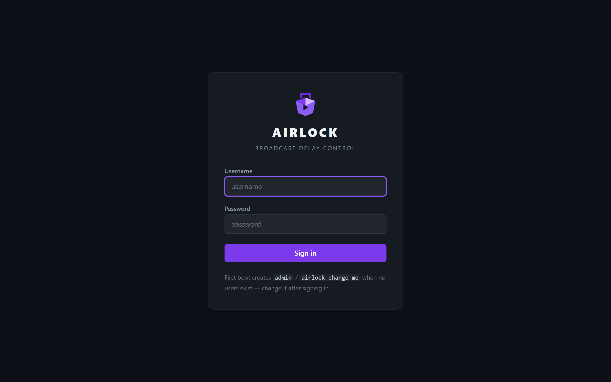

Sign-in is rate-limited to 5 attempts per minute per IP. When LDAP or OIDC SSO
is configured ([§13.3](#133-authentication-server--authentication)), directory
accounts sign in on this same form (LDAP) or via the SSO button; the internal
login always remains available as break-glass.

### The console at a glance

- **Top navigation**:
  - *Operations* — the view-only dashboard over everything ([§3](#3-operations-dashboard-and-the-video-console));
  - *Video* — **Delay channels** (the video console), **Encoders**, **Fills**,
    **Dump clips**;
  - *Audio* — **Delay channels**, **Fills & schedules**, **Censor schedules**;
  - *Data Receivers* — TCP Servers, TCP Clients, UDP Servers, Routing,
    Axia GPIO;
  - *Scripting* (admin);
  - *Server* (admin) — **General**, **Email (SMTP)**, **Authentication**,
    **Users**, **Alert groups**, **License**, **Redundancy**, **API access**;
  - *Account* — Change password, Sign out.
- **Banners** (under the header): an amber/red **licence** banner while the
  licence needs attention (admins get a *Manage license* link); an amber/red
  **redundancy** banner on a backup that has lost its master (or been taken
  over); a sky-blue note on a synced backup — *"Backup — configuration and
  controls are managed by the master at <host>"* ([§13.7](#137-redundancy-primarybackup)).
- **Footer status pills**: NDI runtime, media tooling (ffmpeg), watchdog
  state, licence state — plus a **Redundancy** pill (`Redundancy: primary` /
  `Redundancy: backup Synced` …) when a redundancy role is configured.

Live numbers (meters, depth, states, encoder stats) stream over a single
binary WebSocket at ~10 Hz, so what you see is effectively real time.

## 3. Operations dashboard and the Video console

### Operations — the view-only dashboard

**Operations** is a read-only overview of the whole server — nothing on it
changes state. It is banded into **Input / output video** (one tile per video
channel: state badge, source line, input/output previews, meters, compact
Depth/Drops/Holds counters, alarm strip), **Encoder video** (one tile per
enabled encoder with its live preview and stats), **Audio** (one tile per
audio channel with its depth bar and meters) and **Audit** (the latest 25
audit rows, refreshed every 3 s — every command from every interface lands
here). Clicking any tile jumps to the owning control page and highlights the
card.

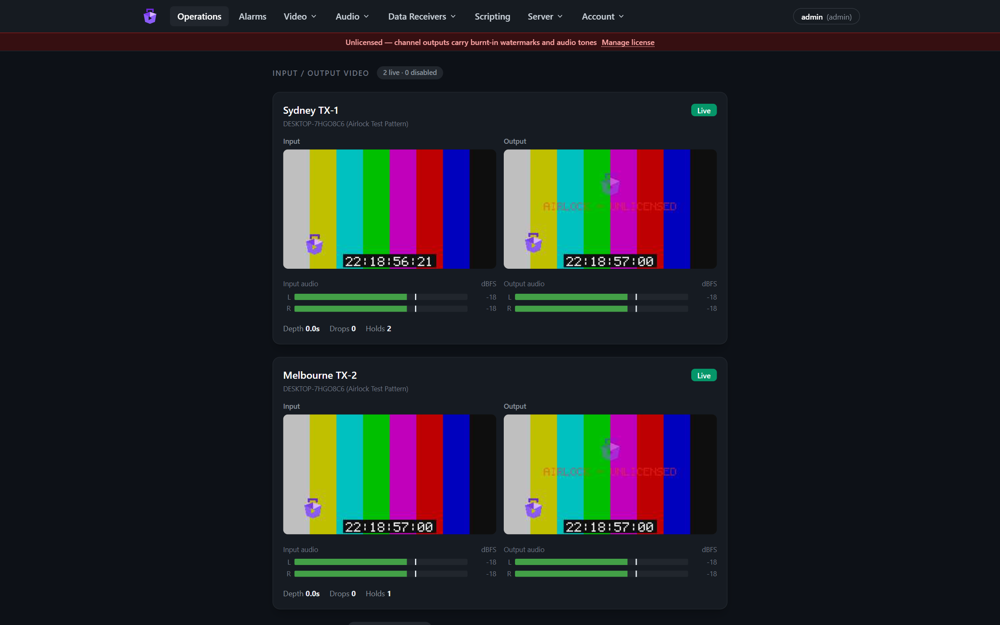

### Video → Delay channels — the video console

The control surface lives on **Video → Delay channels**: the full channel
cards with transport buttons, plus the admin **+ Add channel** control in the
page header. Video views show video channels only — audio delays live
entirely under the Audio menu (which has its own **+ Add channel**, pre-set to
the audio kind).

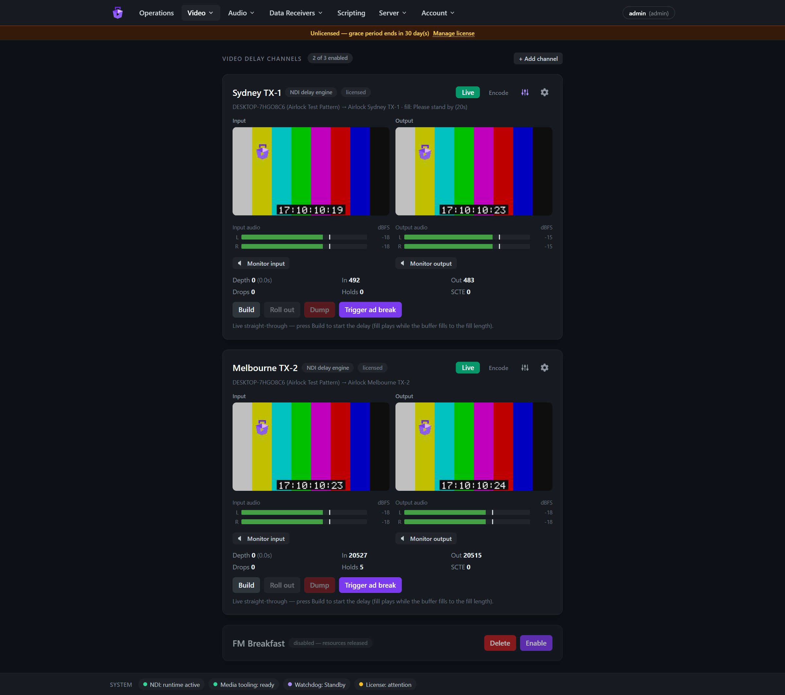

Reading a card, top to bottom:

- **Header** — channel name; engine badge (`NDI delay engine`, or `engine-sim`
  without the NDI runtime); the licence-seat pill (grey `licensed`, or an
  amber **UNLICENSED** button — see [§14](#14-licensing)); the **state badge**; the
  **Encode** pill ([§8](#8-the-encode-option-srtscte-35)); the **sliders icon**
  that opens audio processing ([§5](#5-channel-configuration)); and the gear
  that opens channel settings.
- **Source line** — `<NDI source> → Airlock <name> · fill: <fill name>`.
- **Confidence monitors** — Input and Output previews (~5 fps). The output
  preview shows *what actually airs*, including any watermark. In Delayed the
  output header reads **"Output — delayed N.Ns"**.
- **Audio meters** — L/R RMS bars with peak-hold, −60…0 dBFS, turning amber at
  −9 and red at −3.
- **Monitor input / Monitor output** — click to listen in the browser (Opus
  over WebSocket; needs a WebCodecs browser — Chrome/Edge/Safari 16.4+). One
  audible tap per channel; a green **MONITORING** tag and a volume slider
  appear while live:

  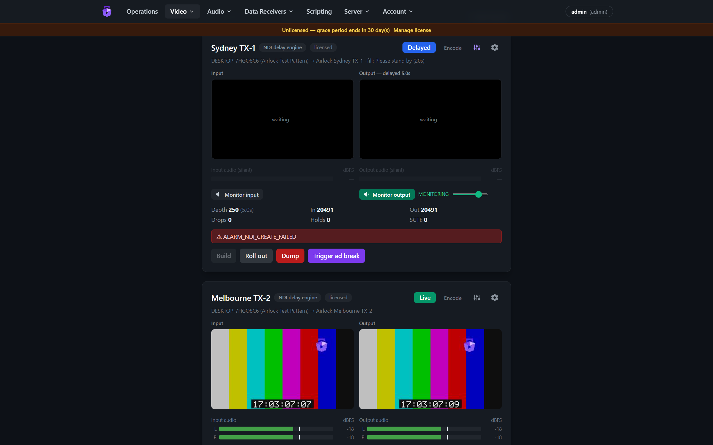

- **Counters** — `Depth` (frames and seconds), `In`/`Out` frame counts,
  `Drops` (red when non-zero), `Holds` (hold-last-frame repeats), `SCTE`
  (splices inserted).
- **Alarm strip** — active alarms in red, e.g. `ALARM_SOURCE_LOST`
  ([§19](#19-alarms-and-troubleshooting)).
- **Transport buttons** — Build / Roll out / Dump / Trigger ad break
  ([§4](#4-operating-the-delay)).

### Adding, disabling and deleting channels (admin)

Click **+ Add channel** in the *Video delay channels* header, type a name (max
24 characters) and pick the kind — **video delay** or **audio delay**. Enter
submits, Esc cancels. Audio channels appear under Audio → Delay channels.

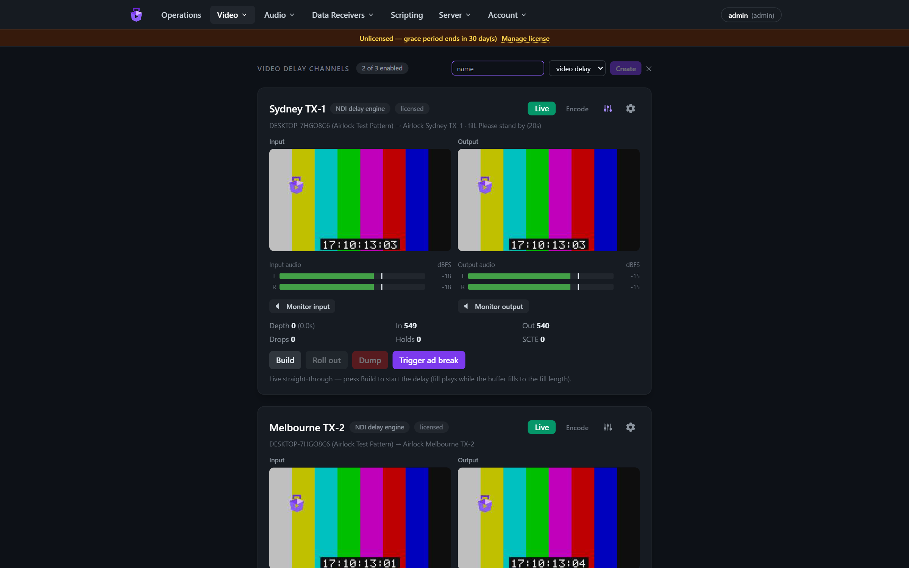

Disabling a channel (gear → **Disable channel**) stops it and releases its
frame pool, engine and NDI receiver; the card collapses to a dimmed stub with
**Enable** and **Delete** buttons (a dimmed tile also shows on Operations).
Deletion is only possible while disabled and removes the channel's GPIO
mappings, schedules and data routes with it.

## 4. Operating the delay

All transport commands live on **Video → Delay channels** (the Operations
dashboard is view-only).

### Build

**Build** is enabled only while **Live**. Press it and:

- the output switches to the channel's **fill** (or freezes the last live
  frame in freeze mode) while the buffer records the live feed;
- the state badge turns amber (**Building**) and the depth counter climbs;
- when the delay window is reached, the channel drops into **Delayed** and the
  programme airs behind live.

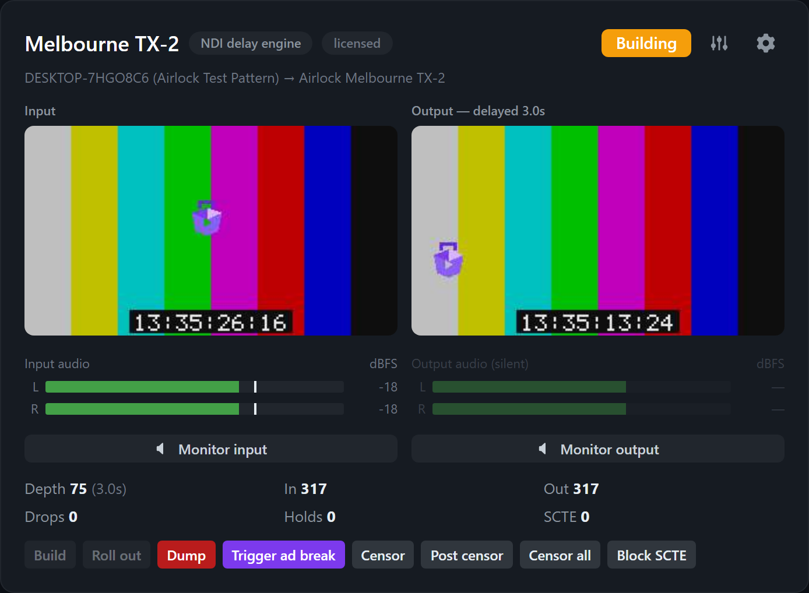

The delay window depends on the delay mode: with **Delay to asset** it is the
fill's full length; with **Delay to time** it is a fixed window
([§5](#5-channel-configuration)).

### Delayed — the protection window

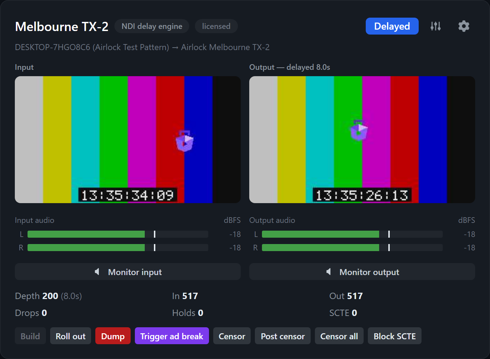

In **Delayed** the operator can:

- **Dump** — flush the buffer. A confirmation dialog (*"DUMP <name>? The
  buffer flushes and the channel returns to live."*) guards the button. The
  flushed content is written as a dump clip and alert-group emails go out
  ([§6](#6-dump-alerts-clips-and-alert-groups)).
- **Roll out** — unwind the delay back to live at the end of protected
  programming. The badge turns orange (**RollingOut**) while the depth drains,
  ending in the forward jump cut:

  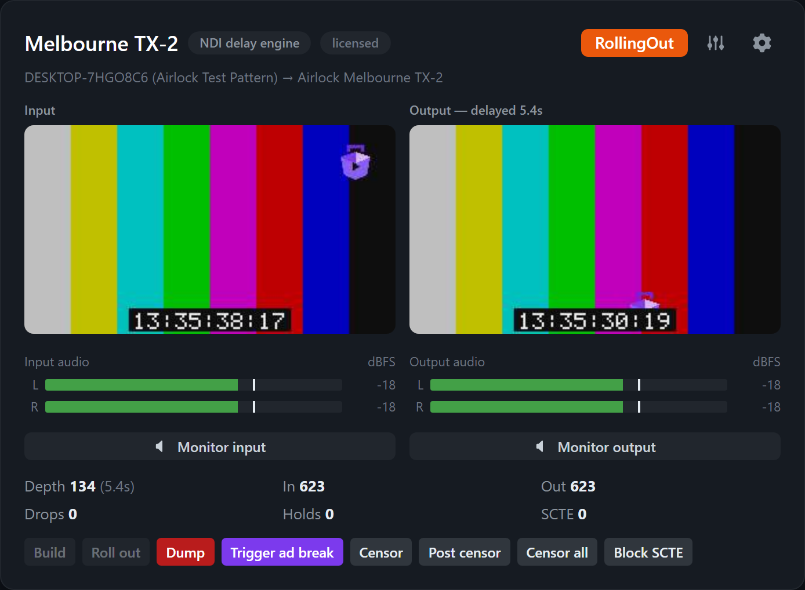

- **Trigger ad break** — fire the `adbreak` SCTE trigger template: one press
  emits SCTE-104 in the NDI output's VANC **and** (if the encoder runs)
  PTS-aligned SCTE-35 in the transport stream, with pre-roll.

### Censor — bleep without dumping

Sometimes a word needs to go but the pictures don't: video channels carry the
profanity-delay **censor**, which replaces a span of the **programme audio**
with tone (or silence) while the **video passes through untouched** — no
buffer is lost, unlike Dump. Two controls sit beside the transport buttons:

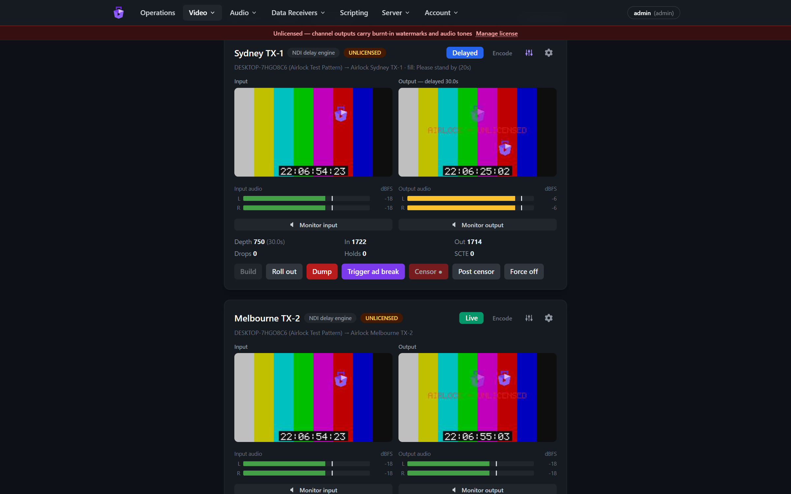

- **Censor** — a hold: click to open, click again to release (the button
  reads **Censor ●** and pulses while engaged). The censored span is
  **back-dated** — a press marks from *censor size + pre pad* **before** the
  moment you pressed, so operator reaction time is covered — and holds *post
  pad* past the release to cover pulling off early. On a delayed channel the
  tone airs when those frames reach the output (the protection rides the
  delay); pressed while Live it applies immediately. Repeated or held presses
  extend one merged span.
- **Post censor** — replaces the **on-air output audio immediately** while
  engaged, regardless of delay depth — the last-ditch control when something
  is already at the output tap.
- **Force off** — appears while anything is engaged; clears every censor
  state, including marked spans that haven't aired yet.

Censor works in every channel state and is never licence-gated. The
`censorActive` / `postCensorActive` GPO lamp sources follow these controls
([§10](#10-axia-livewire-gpio)), and a **hold timeout** (default 30 s,
configurable per channel) auto-releases a censor whose release edge never
arrives — a GPI button whose "off" was lost in a dropped connection can't
leave the bleep latched on air.

### Blocking SCTE cues

When a channel is passing SCTE cues from its source ([§8](#8-the-encode-option-srtscte-35)),
a **Block SCTE** button sits in the card's action row. Press it to **stop
inbound cues from reaching air on either output** immediately — a live incident
control that needs no policy edit; the button reads **SCTE blocked ●** and
pulses red while engaged. It respects the same safety rule as the policy tab:
*a return that would otherwise strand the downstream inside an open break still
airs*. Blocked cues are still decoded, counted, audited and still fire scripts.
The persistent per-channel rules live on the **SCTE** policy tab
([§5](#5-channel-configuration)).

### Simulating source loss (engine-sim)

Without the NDI runtime, channels run against a synthetic source and admins
get **Kill sim source / Restore sim source** buttons to rehearse the
source-loss behaviour. With real NDI, killing the source upstream has the same
effect — hold-last-frame plus `ALARM_SOURCE_LOST`:

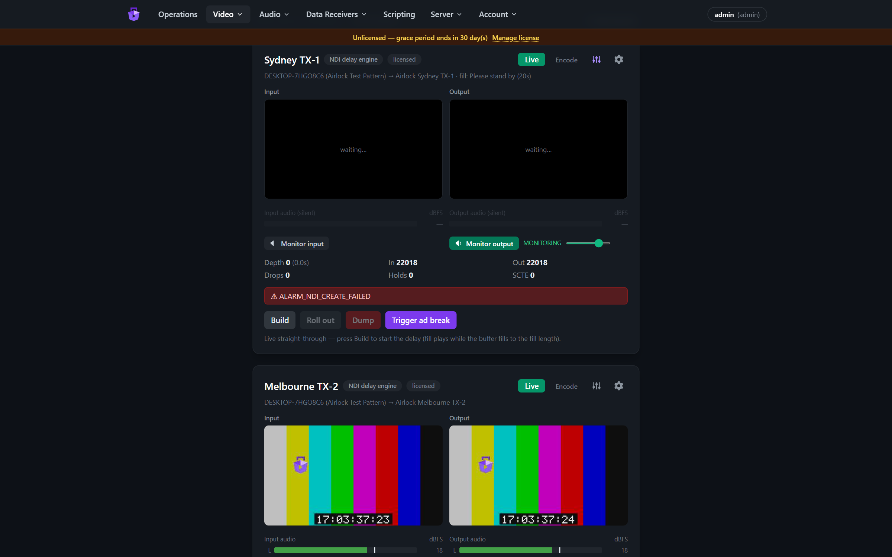

## 5. Channel configuration

Open the gear on a channel card. The settings modal is tabbed — **Source &
name · Fill · Delay mode · Censor · SCTE · Alarms · Feed stats**. Changes
require the **admin** role (Feed stats is visible to everyone); source, fill
and delay-mode changes are only permitted while the channel is **Live**.

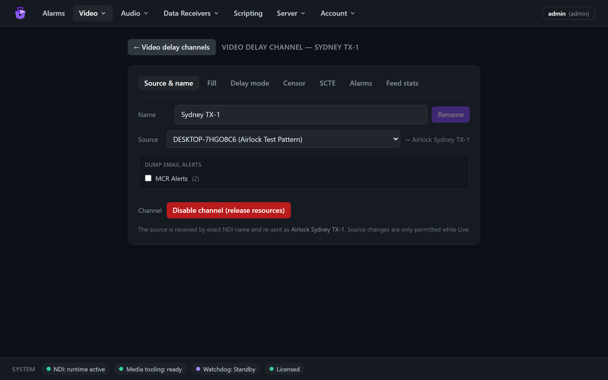

### Source & name

- **Name** — rename the channel (letters/digits/space/`- _ .`, max 24). The
  NDI output name (`Airlock <name>`) follows at the next engine restart.
- **Source** — a dropdown of NDI sources currently visible to the network
  finder, plus **"Colour bars + tone (built-in)"**: an in-process test
  generator (SMPTE-style bars, bouncing Airlock mark, 1 kHz −18 dBFS tone)
  that switches on and binds in one click and persists across restarts. Handy
  for commissioning and the screenshots in this manual.
- **DUMP email alerts** — tick the alert groups to notify on DUMP
  ([§6](#6-dump-alerts-clips-and-alert-groups)).
- **Disable channel (release resources)** — see [§3](#3-operations-dashboard-and-the-video-console).

### Fill — static assignment and dayparted schedule

The static **Fill** picker offers the *ready* fill assets
([§7](#7-fill-assets)) or **"Freeze frame (no fill — delay to time)"** to
build against a freeze of the last live frame instead of playing fill. A fill
must fit the channel's maximum delay depth — the server refuses an
over-length assignment rather than risk the buffer.

Below it, the **Dayparted fill schedule** swaps the effective fill by time of
day and day of week — e.g. a breakfast slate on weekday mornings, the station
default otherwise:

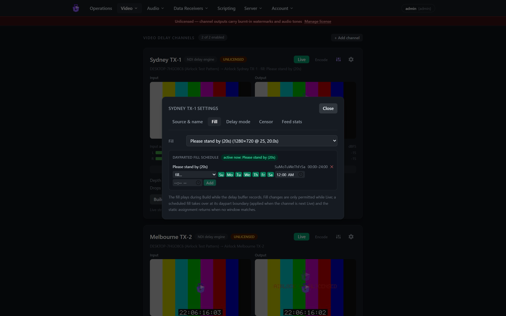

- Each row is *fill × days × HH:MM–HH:MM window*. While an enabled row's
  window matches the current server time, that row's asset is the channel's
  effective fill; a green **"active now: <fill>"** pill shows which one won.
- Overlapping rows: the **first matching row wins** (deterministic — unlike
  the audio fill schedules, which round-robin per build). When no row
  matches, the **static assignment returns**.
- Boundary changes apply **only while the channel is Live** (the fill is a
  standing assignment the engine conforms once, not a per-build pick). A
  crossing that happens mid-delay is retried and lands when the channel next
  returns to Live.

### Delay mode

- **Delay to asset** — the delay window equals the fill's full length (a
  20 s fill gives a 20 s delay).
- **Delay to time** — a fixed window in seconds (0.25 s steps, capped at
  min(channel max depth, global cap — shown as "cap Ns")). A longer fill is
  cut short at the window; a shorter fill either **loops** (checkbox) or
  plays once and freezes its last frame, silent, until the window is
  reached.
- Changes **Apply** while Live and take effect at the next Build.

### Censor parameters

The Censor tab tunes the reaction-time compensation behind the card's Censor
buttons ([§4](#4-operating-the-delay)):

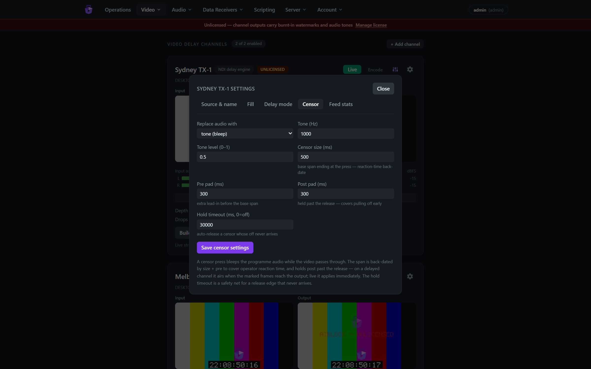

- **Replace audio with** — `tone (bleep)` or `silence`; **Tone (Hz)** and
  **Tone level (0–1)** shape the bleep.
- **Censor size (ms)** — the base span *ending at the press* (the
  reaction-time back-date; default 500).
- **Pre pad (ms)** — extra lead-in before the base span (default 300).
- **Post pad (ms)** — held past the release, covering pulling off early
  (default 300).
- **Hold timeout (ms, 0 = off)** — auto-release a censor whose off never
  arrives (default 30000).

### SCTE policy

Video channels carry SCTE-104 cues from the source through the delay and
re-emit them (see [inbound SCTE](#inbound-scte--cue-pass-through-and-conversion)
in §8). The **SCTE** tab governs what happens to those cues per channel, in
three groups:

- **Cue output** — **Re-insert cues on the NDI output** (*"the delayed
  SCTE-104, verbatim, on the frame it arrived with"*), **Convert cues to
  SCTE-35 on the SRT output** (*"same splice point, on the transport stream"* —
  needs the encoder, [§8](#8-the-encode-option-srtscte-35)), and **Pass other
  metadata (timecode, tally…)**.
- **Absolute-time cues** — a cue that names a wall-clock moment (**UTC/VITC/GPI**)
  the delay has already carried past is a hazard: forwarding it tells the
  downstream to splice at a time that has gone. Choose **Drop it and alarm
  (recommended)** or **Forward it anyway**. (At zero depth nothing has moved, so
  the cue still stands and is forwarded regardless.)
- **Block cues from reaching air** — **Block break starts (splice-out)**,
  **Block returns (splice-in)** and **Block cues carrying no splice
  (time_signal)**. A blocked cue is still decoded, counted, audited and still
  fires scripts — it simply never leaves the box. **Blocking returns while
  break starts still air strands the downstream inside an ad break**, so if a
  break is open Airlock airs the return anyway and raises
  `ALARM_SCTE_BREAK_ORPHAN`. To stop cues *right now* without editing policy,
  use **Block SCTE** on the channel card ([§4](#4-operating-the-delay)).

**Save SCTE policy** applies the settings (confirmed with **saved ✓**).

### Alarms

The **Alarms** tab turns on **Silence detection** for the channel (peak below a
**Threshold (dBFS)** for a **Hold (s)**, restored above threshold +
**Hysteresis (dB)** for a **Restore (s)**) and picks which alert groups are
emailed when this channel's alarms go active or restore. The behaviour and the
Alarms page it feeds are covered in
[§6.1](#61-alarm-emails-webhooks-and-silence-detection).

### Feed stats

A read-only reference for the bound feed — useful when confirming what an
upstream source is actually delivering:

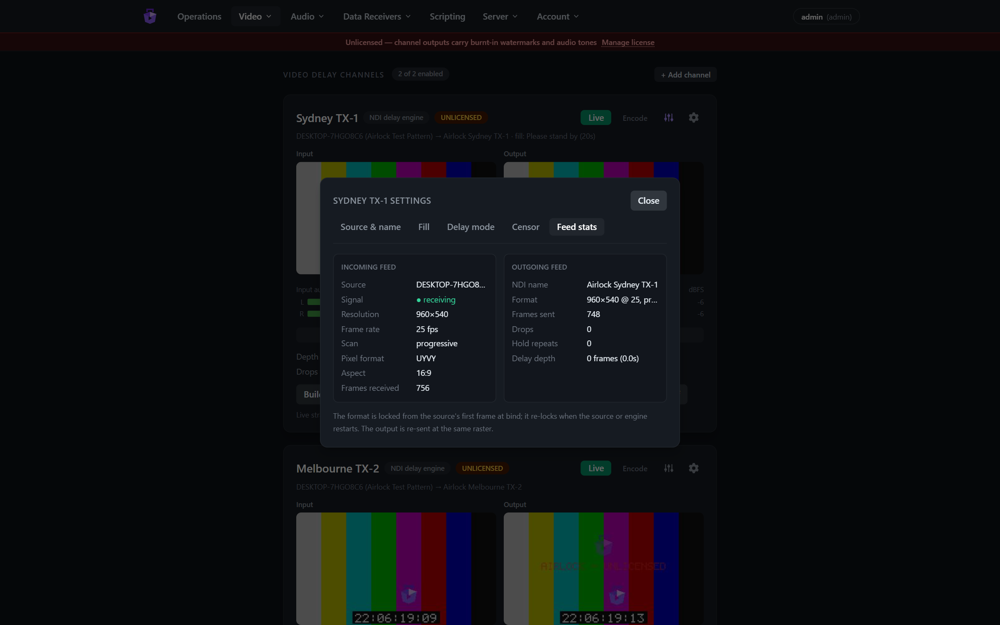

- **Incoming feed**: source name, signal state (● receiving / ● lost),
  resolution, frame rate (fractional rates shown with their num/den, e.g.
  "29.97 fps (30000/1001)"), scan, pixel format (FourCC), aspect, frames
  received.
- **Outgoing feed**: the NDI output name, the re-sent format, frames sent,
  drops, hold repeats and the current delay depth.
- The format is **locked from the source's first frame at bind** and re-locks
  when the source or engine restarts; the output is re-sent at the same
  raster.

### Channel audio processing (trim · EQ · compressor)

The **sliders icon** in the card header (tinted violet while active) opens the
audio-processing modal — a stereo-linked processing chain on the channel's
delayed PGM output. Changes apply **live on air** (there is no Save button);
the encode branch keeps its own R128 loudness chain. Requires the operator
role.

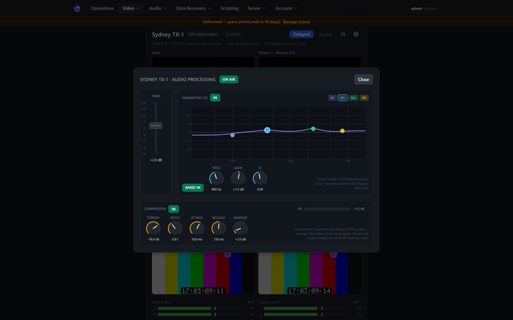

- Master **On air / Bypassed** toggle.
- **Trim** — ±24 dB fader with centre detent (double-click returns to 0).
- **Parametric EQ** — In/Out toggle; four bands **LF · M1 · M2 · HF** with a
  draggable response-curve editor (the curve is the actual engine response —
  RBJ biquads at 48 kHz) and per-band **Freq / Gain / Q** knobs.
- **Compressor** — In/Out toggle; **Thresh / Ratio / Attack / Release /
  Makeup** knobs and a live **GR** (gain-reduction) meter fed from telemetry.

## 6. DUMP alerts, clips and alert groups

Every DUMP:

1. **Flushes the buffer** — the offending span never airs (audio is faded at
   the splice, so the exit is clean);
2. **Writes a dump clip** of the flushed content for compliance review;
3. **Emails the channel's alert groups** (when SMTP is configured) with the
   channel, who dumped and from which interface, the time, the flushed depth,
   and a login-protected deep link to play the clip in the console.

**Video → Dump clips** lists every clip (auto-refreshing): when, channel,
duration, who/via, and status — `writing` (violet) while the file is being
finalised, `ready` (green) once playable as MP4, `raw` (amber) for
audio-channel WAV dumps.

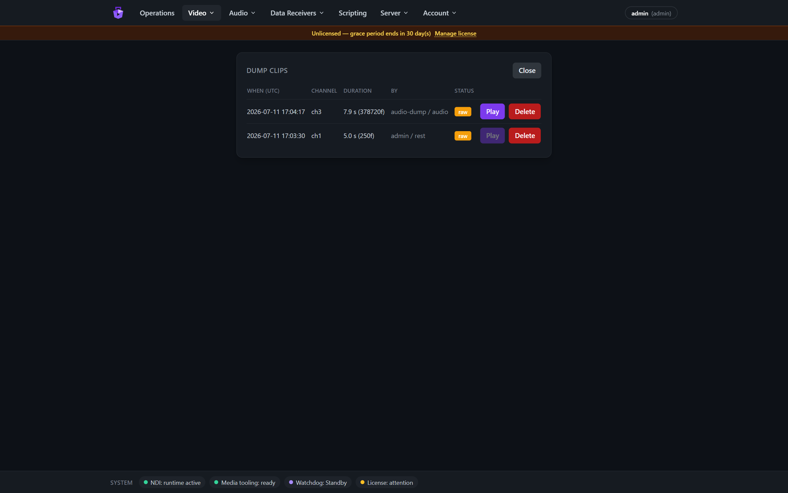

**Play** opens the clip player; alert-email links open the same player after
login:

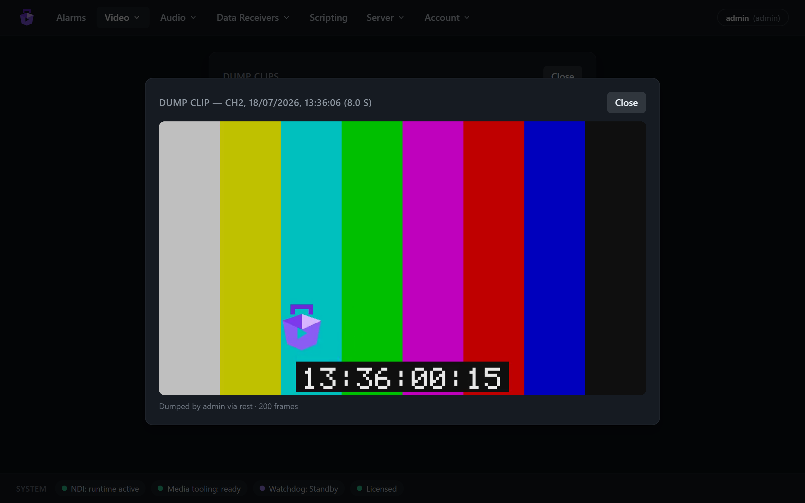

**Alert groups** (Server → Alert groups, admin) are named recipient lists
(one email per line or comma-separated). Assign any number of groups to each
channel in its settings. Groups are emailed on DUMP, and — if subscribed — on
alarms (below).

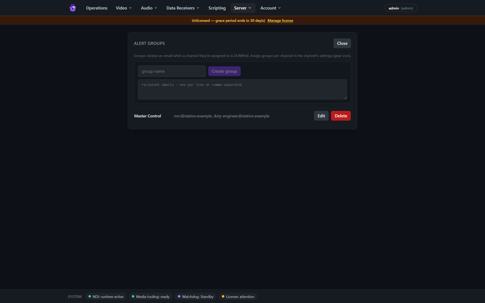

### 6.1 Alarm emails, webhooks and silence detection

The **Alarms** page (top navigation, all roles) shows every alarm active right
now — severity, channel (click to jump to it), when it raised and for how long —
plus the full raise/clear history from the audit log, newest first with paging.
Active alarms refresh every few seconds.

Alarms (video source loss, delay engine faults, encoder down, A/V offset drift,
audio delay down, audio silence) can email alert groups when they go **active**
and again when they **restore**. Routing needs both halves:

1. **On the group** (Server → Alert groups) — tick the alarm categories the
   group cares about (*Video delay*, *Encoding*, *Audio delay*, *System*) and
   whether it gets *Email on active* and/or *Email on restored*.
2. **On the channel** — tick the group under **Alarm email alerts** in the
   channel's settings (video) or the audio card's **Alarms** tab (audio). This
   assignment is separate from the DUMP alert-group assignment. A channel with
   no alarm groups assigned sends no alarm emails.

**Webhooks**: a group can also (or instead) deliver alarms to a third-party
system — set a *Webhook URL* on the group (Server → Alert groups). Airlock POSTs
one JSON object per transition (`event, active, code, friendlyName, category,
severity, channel, channelName, whenUtc, activeDurationSeconds, instance`); if a
*secret* is set the body is signed with `X-Airlock-Signature:
sha256=HMAC-SHA256(body)` so the receiver can verify authenticity. The same
category subscriptions, active/restored flags and per-channel assignment apply.
Webhooks work without SMTP configured, and a *Test webhook* button fires a
synthetic payload. Delivery is one attempt per event (10 s timeout) — successes
and failures are audited as `WEBHOOK_SENT` / `WEBHOOK_FAILED`.

Emails are debounced (Server → Email): an alarm must persist (default 15 s)
before the ACTIVE email, must stay clear (default 30 s) before the RESTORED
email (which includes the outage duration), and a flapping alarm is throttled by
a per-alarm cooldown (default 300 s). Momentary alarms (FIFO overflow,
SCTE-in-skip, metadata queue) auto-clear 30 s after their last occurrence. On a
primary/backup pair only the primary sends (the backup mirrors the config but
suppresses outward email).

**Audio silence detection** (audio card → cog → Alarms) raises
`ALARM_AUDIO_SILENCE` (and a **SILENCE** badge on the card) when the channel's
*input* peak stays below a threshold (default −50 dBFS) for the hold time
(default 30 s); it restores once the level holds above threshold + hysteresis
(default 6 dB) for the restore window (default 5 s). Detection pauses while the
audio child itself is down — that condition is the separate `ALARM_AUDIO_DOWN`.
All alarm raise/clear transitions are written to the audit log as `ALARM_RAISED`
/ `ALARM_CLEARED`.

**Video channels** have the same silence detector on their received (input)
programme audio — channel settings → **Alarms** tab, identical threshold / hold
/ hysteresis / restore knobs, raising `ALARM_VIDEO_SILENCE`. A source that keeps
sending video but drops its audio stream counts as silent; a fully dead feed is
reported as source-lost instead (the two alarms never double-fire). The Alarms
tab also holds the channel's alarm alert-group assignment.

### 6.2 SNMP monitoring & control

An embedded **SNMP v2c agent** (Server → General) lets an NMS poll Airlock by OID
under `1.3.6.1.4.1.99999.134` (MIB module: `docs/airlock.mib`): server scalars
(alarm counts, worst severity, redundancy role, licence, watchdog) and a
per-channel table (name, kind, delay state, depth, alarms, censor/cough lamps,
encoder, watermark). Reads use the *read community*; both primary and backup
answer for their own state.

With a separate *write community* configured, `airlockChannelCommand`
(`…10.1.12.<ch>`) accepts the Axia-GPIO-parity transport commands via SNMP SET —
1 build · 2 dump · 3 dump-all · 4 exit · 5/6 cough on/off (audio) · 7/8 censor
on/off. Commands route through the same gated path as GPIO/REST and are audited
with source `snmp`; a locked backup refuses SETs (`authorizationError`). Leaving
the write community empty keeps the agent read-only.

```
snmpwalk -v2c -c public  airlock:1161 1.3.6.1.4.1.99999.134
snmpget  -v2c -c public  airlock:1161 1.3.6.1.4.1.99999.134.4.0        # worst severity
snmpset  -v2c -c <write> airlock:1161 1.3.6.1.4.1.99999.134.10.1.12.1 i 1   # BUILD ch1
```

**Linux note**: binding the standard port 161 needs `CAP_NET_BIND_SERVICE`
(systemd: `AmbientCapabilities=CAP_NET_BIND_SERVICE`, or `setcap` on the binary)
— otherwise pick a port ≥ 1024 (e.g. 1161). A failed bind is audited as
`SNMP_BIND_FAILED` and the console log names the fix.

## 7. Fill assets

**Video → Fills** is the fill library (upload/delete are admin):

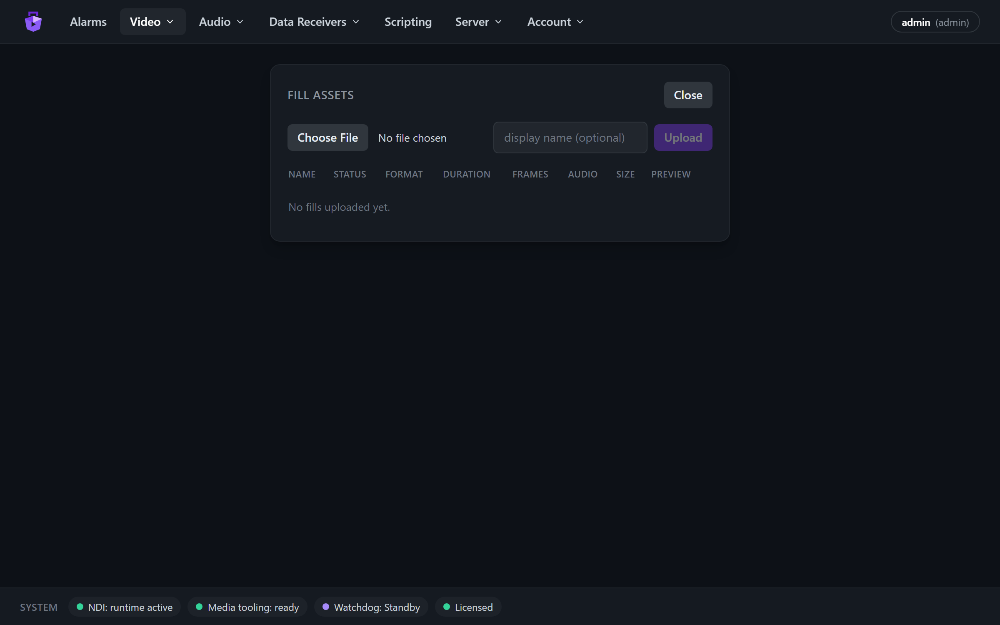

Upload any video file (an optional display name can be set); Airlock conforms
it for playout and generates a low-bitrate browser preview (needs ffmpeg — an
amber banner explains when uploads can be stored but not probed). The table
shows status (`ready` / `uploaded` / `failed`), format, duration, frames,
audio channels and size.

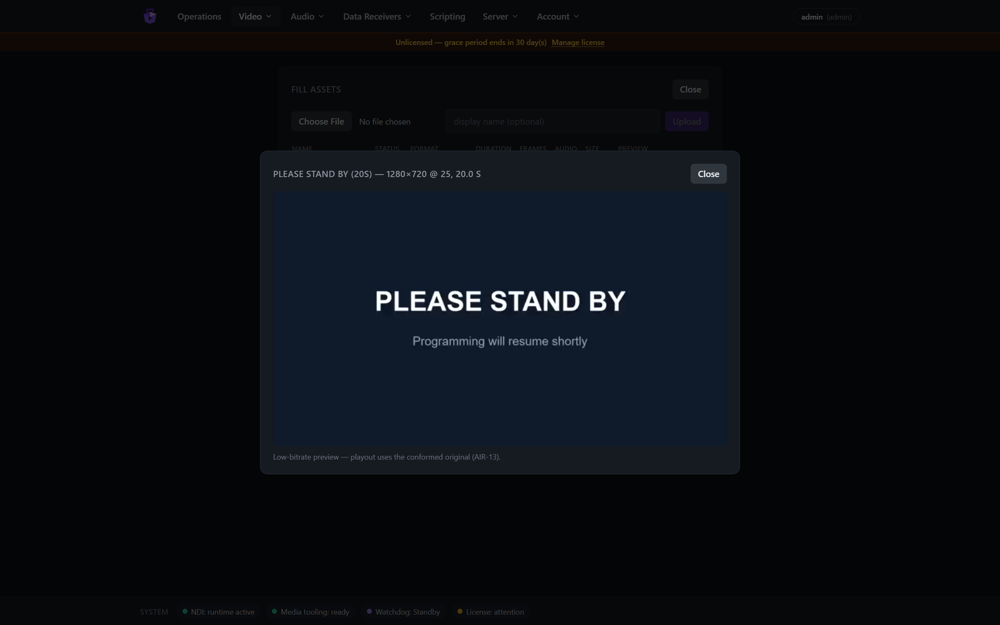

A fill cannot be deleted while a channel's static assignment **or any
channel's fill schedule** references it — the refusal names the blocking
channels so you know exactly where to unassign:

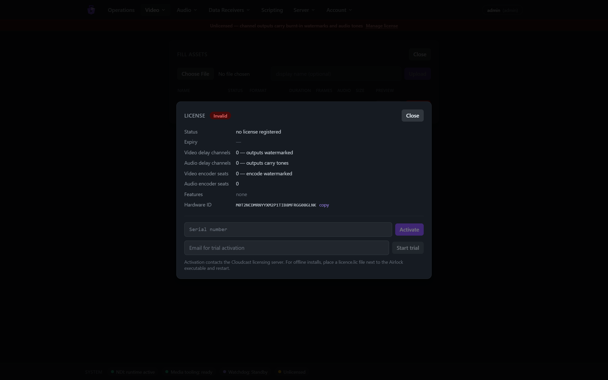

## 8. The encode option (SRT/SCTE-35)

The licensed **ENCODE** module encodes an H.264/AAC MPEG-TS over **SRT**, with
SCTE-35 ad markers — a contribution feed that carries the same protection
window as the NDI output.

Open a channel's **Encode** pill (admin) to configure and enable:

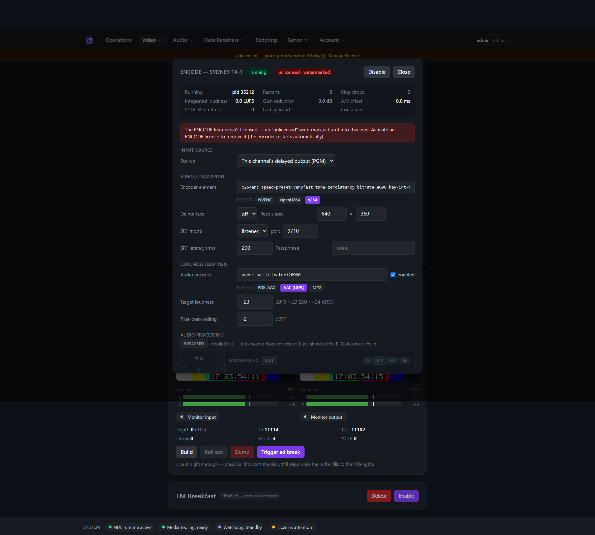

- **Input source** — *"This channel's delayed output (PGM)"* (the default) or
  *"External NDI source"*: any NDI source encoded directly, **bypassing the
  delay**. Raster and framerate lock from the source's first frame (the
  encoder restarts once when they differ from the last known format).
- **Video / transport** — GStreamer encoder element with presets **NVENC**
  (hardware), **OpenH264**, **x264** (software), or any custom element string;
  deinterlace; output resolution; **SRT mode** (listener or caller + host),
  port, latency, optional AES passphrase (write-only).
- **Loudness (EBU R128)** — audio encoder element (FDK-AAC / AAC (LGPL) /
  MP2 presets), target loudness (−23 LUFS EBU / −24 ATSC) with a true-peak
  ceiling; a loudness servo and limiter keep the feed compliant, and A/V
  alignment is automatic (an offset beyond ±5 ms raises an alarm).
- **Audio processing** — the same trim/EQ/compressor strip as the channel
  chain ([§5](#5-channel-configuration)), applied to **this encoder's audio
  only**, ahead of the loudness chain. *In circuit / Bypassed* toggle; applied
  live without restarting the encoder; its GR meter reads the encoder's own
  stage.
- **SCTE-35** — enabled flag, PID, null-packet interval.

Saving the config sections restarts a running encoder. The status grid shows
the child process pid, restarts, ring drops, integrated loudness, gain
reduction, A/V offset, SCTE-35 count and consumer heartbeat.

The encoder runs as a **supervised child process per channel** — an encoder
crash never affects the NDI programme output; the supervisor restarts it and
raises/clears `ALARM_ENCODE_DOWN`.

**Video → Encoders** shows one card per enabled encoder with a live output
preview (the watermark is visible on unlicensed feeds), loudness/A-V/drops/
SCTE stats, its **licence seat** state, and Assign/Release seat buttons
(admin); the **cog in the card header** opens the Encode modal. The
Operations dashboard mirrors these as read-only tiles.

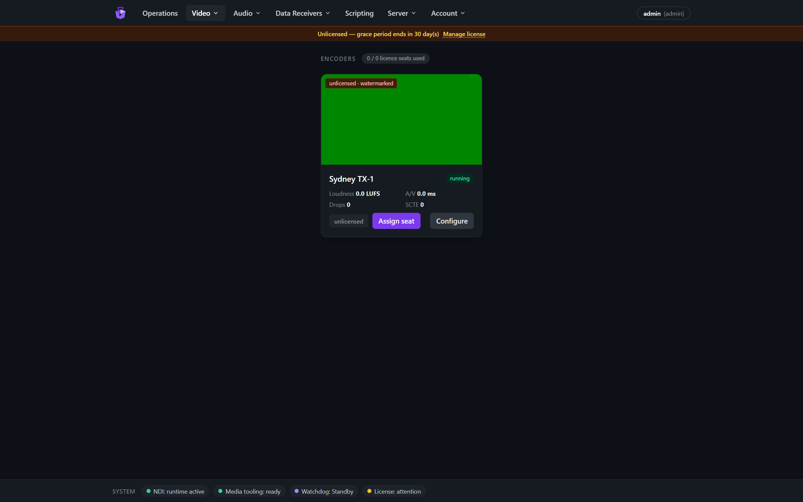

### Inbound SCTE — cue pass-through and conversion

Everything above concerns SCTE markers Airlock **originates** (the `adbreak`
trigger, [§4](#4-operating-the-delay)). Airlock also **carries markers that
arrive on the source**: it decodes inbound **SCTE-104** from the source's NDI
metadata, delays each cue **frame-exactly** through the same buffer as the
pictures, and re-emits it so the splice still lands on the right frame after
the delay — re-inserted **verbatim** in the NDI output's metadata and, when the
encoder runs, converted to **PTS-aligned SCTE-35** on the SRT/TS rail. A cue
that would otherwise fire on both rails is de-duplicated within a ±2-frame
window so the transport stream never double-splices.

What each channel does with those cues — re-insert on NDI, convert on SRT,
handle a cue whose absolute time the delay has outrun, or block break-starts/
returns/`time_signal` — is set on the channel's **SCTE** policy tab
([§5](#5-channel-configuration)), with the live **Block SCTE** control on the
card ([§4](#4-operating-the-delay)) for incidents. Scripts can react to cues as
they arrive and as they air (`scteReceived` / `scteAired`,
[§12](#12-scripting)).

## 9. Audio profanity delay

Audio channels are broadcast profanity delays on a sound-device pair,
modelled on long-serving industry practice: the delay **builds by playing
programme slightly slow** (or by inserting fill) and **exits slightly fast**
(or jump-cuts), with equal-power crossfades so nothing clicks. They live on
**Audio → Delay channels**:

> An audio channel's output — or an external NDI audio source — can also be
> **streamed out** (RTMP / HLS / Icecast / RTP) and **received** back over RTP
> to a local device; see [§16](#16-audio-streaming-encoders) and
> [§17](#17-audio-decoders-and-rtp-transport).

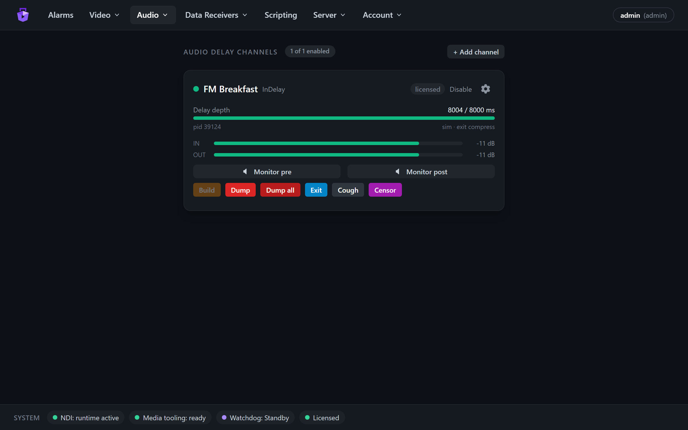

States: **Idle** (grey) → **Building** (amber) → **InDelay** (green) →
**Exiting** (sky) → Idle. The card shows a depth progress bar
(`current / configured ms`), the child process pid and restart count, backend
summary, IN/OUT level meters, and the command row:

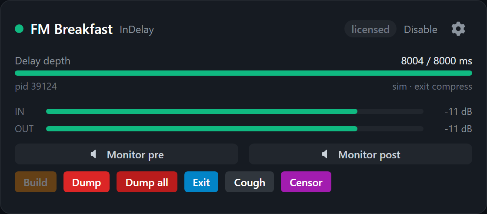

### The command set

| Command | Effect |
|---|---|
| **Build** | Start building the delay (Idle only). |
| **Dump** | Discard the configured dump segment from the buffer — the write pointer rewinds; if less than 20% of the delay would remain, it escalates to a full dump. Dumped audio is captured to WAV in Dump clips. |
| **Dump all** | Flush the whole buffer to true-zero depth (with a softening fade). |
| **Exit** | Leave delay per the exit mode — `compress` (drain fast) or `rollout`. |
| **Cough** | Momentary kill/re-arm. |
| **Censor** | Overwrite the about-to-air span with tone/silence/file — depth is *unchanged* (nothing is removed, unlike Dump); repeated presses extend the region; a configurable pre/post bracket widens it. |

Held cough/censor (from GPI or the API's on/off pairs) carries the same
stuck-on protection as the video censor: level reconciliation corrects a
lost release edge, and the hold timeout auto-releases a censor whose off
never arrives. Video channels have their own censor with the same model —
see [§4](#4-operating-the-delay).

Below the meters, **Monitor pre / Monitor post** listen to the channel in the
browser — *pre* is the input as captured, *post* is the delayed on-air output
(same Opus/WebSocket mechanism as the video cards; listen-only, so every role
gets it).

### Configure — device, delay and censor tabs

The **cog** in the card header opens the four-tab Configure modal (admins can
also **rename** the channel at the top of it). Configuration changes
**hot-apply to the running delay** — saving no longer interrupts audio or
resets the depth; only device/topology changes (backend, device, channel
assignments, sample format, growing the delay beyond the allocated ring, or
assets the child didn't start with) restart the child, and the restart reason
is logged.

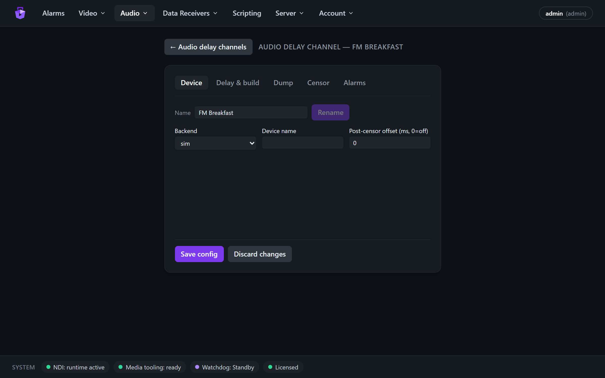

- **Device** — backend `asio` (Windows; e.g. the Axia IP-Audio driver),
  `alsa` (Linux) or `sim` (no hardware — demo/test). With ASIO, a **Device**
  dropdown lists the installed drivers and **Main input / Main output** offer
  the driver's *named channel pairs* (Axia Livewire source names collapse to
  one entry, e.g. `1–2 · Livewire 1`); alsa/sim fall back to numeric channel
  offsets. Optional **post-censor offset** (an extra-delayed clean output on
  the pair above the main pair) and **Rollout return channel** (the mix-minus
  return pair — see below).
- **Delay & build** — delay size (ms), build/exit rates (%), exit mode
  (`compress`/`rollout`), build mode (`expand` = stretch live, `insert` =
  play fill), fill strategy (`squeeze` = time-stretch the asset to exactly
  the build window, or `silent`), default fill asset. With exit mode
  `rollout`, **Rollout mix-minus return** + **Return overlap (ms)** enable a
  separate **studio return output** during rollout: the retiring delay buffer
  drains onto the return pair *minus the live input* (N-1), so the presenter
  hears the tail of the delayed programme without hearing themselves — the
  main output still takes the clean jump cut.

  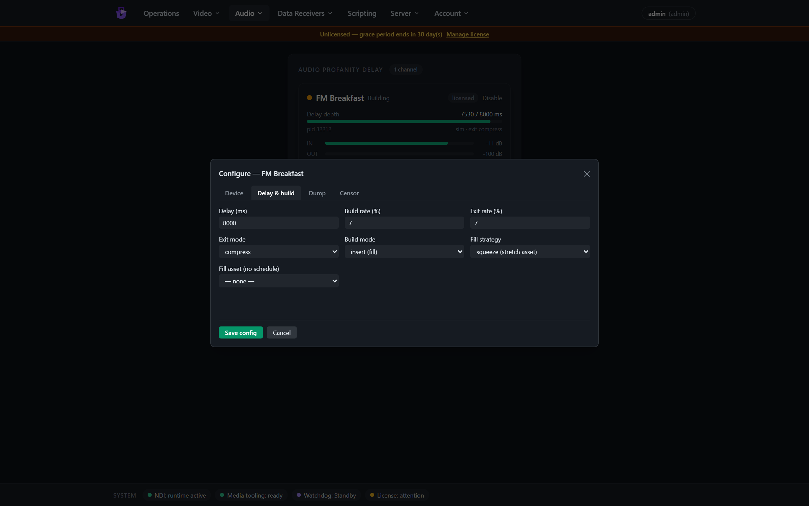

- **Dump** — dump size (ms, 0 = all), dump strategy (`dump` = discard, or
  `censor` = replace with a file), **build after dump**
  (`disabled` = hold the reduced depth, or rebuild automatically after
  dump / dump-all / both), censor file.

  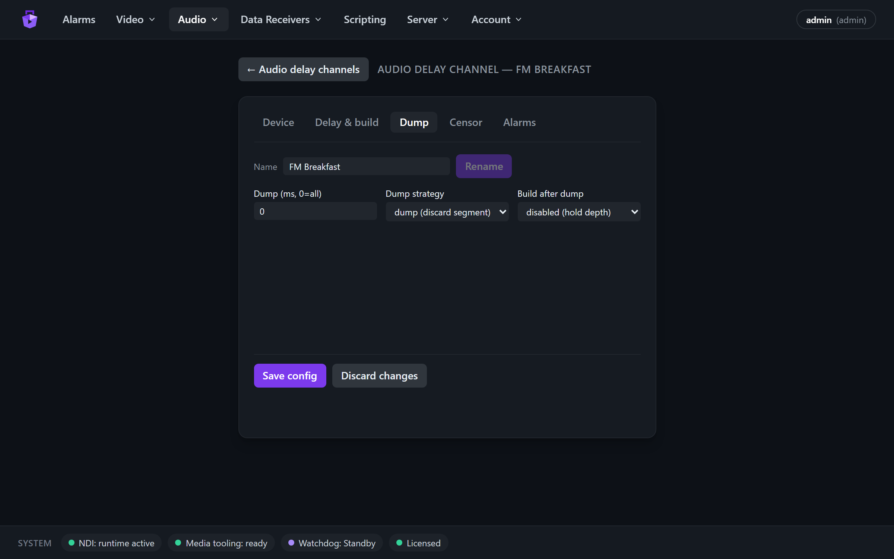

- **Censor** — strategy (`tone`/`silence`/`file`), bleep frequency, censor
  file, censor size, pre/post bracket (ms).

  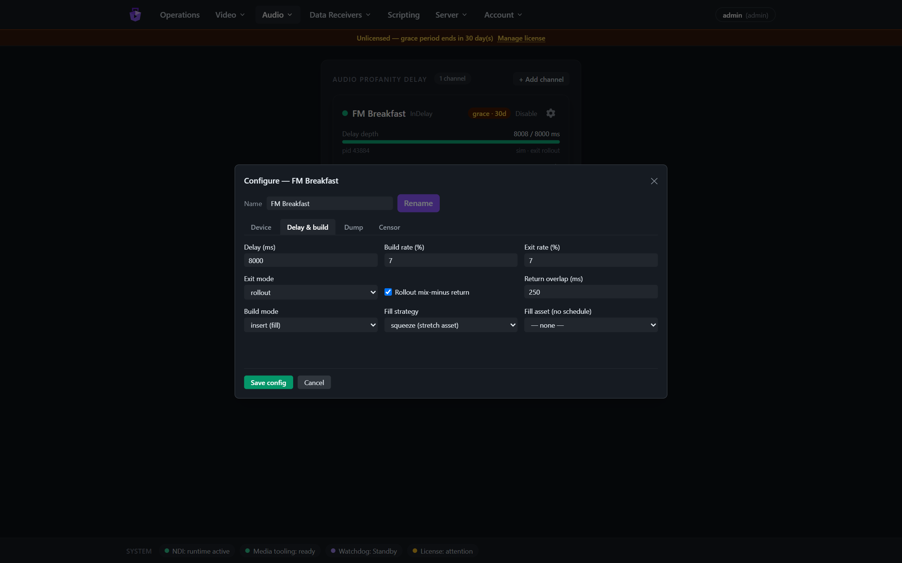

### Fills and dayparted schedules

The audio fill library (MP3/WAV uploads, conformed to 48 kHz stereo) and the
**dayparted fill schedules** live on **Audio → Fills & schedules** — with
build mode `insert` + fill strategy `squeeze`, matching schedule rows
(fill × days × time window) are round-robined at build time. The matching
**censor schedules** (which censor file plays, by time of day) are on
**Audio → Censor schedules** and apply with dump strategy `censor`. Audio
cards link across with **Fill schedule →** / **Censor schedule →** when their
configuration makes those pages relevant.

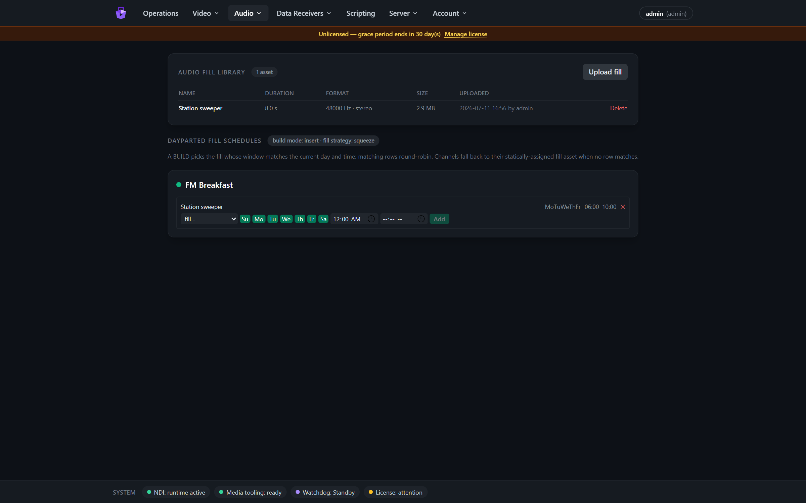

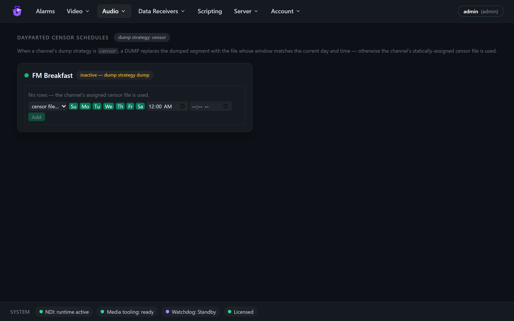

### Post-delay cough/censor

Installations using the extra-delayed **post-censor output** (Device tab →
post-censor offset) get a second protection point *after* the main delay:
**held** cough and censor on that output. These have no web buttons — they are
driven from hardware GPI (`coughpost` / `censorpost` mapping commands,
held-only: active while the pin is held) or REST (`coughposton/off`,
`censorposton/off`), with `postCoughActive` / `postCensorActive` GPO lamps
([§10](#10-axia-livewire-gpio)).

Audio channels take the same seat/watermark model as video: an unseated audio
channel plays a ~1 s tone burst every 30 s on its output
([§14](#14-licensing)). Like the encoder, each audio channel runs as a
supervised child process — a driver crash can't take the server down
(`ALARM_AUDIO_DOWN` while it restarts). Audio commands are also available
over TCP, GPIO and scripting, and audio DUMPs land in Dump clips as WAV.

## 10. Axia Livewire GPIO

**Data Receivers → Axia GPIO** integrates Livewire GPIO nodes (xNodes etc.)
so hardware panels drive the delay and lamps follow its state. Four tabs:

**Devices** (admin) — add nodes by name/IP/port (default 93; password
optional — passwordless nodes are fully supported). The table shows
connection state, discovered capabilities (GPI/GPO counts, sources/
destinations) and whether GPI simulate-writes are supported.

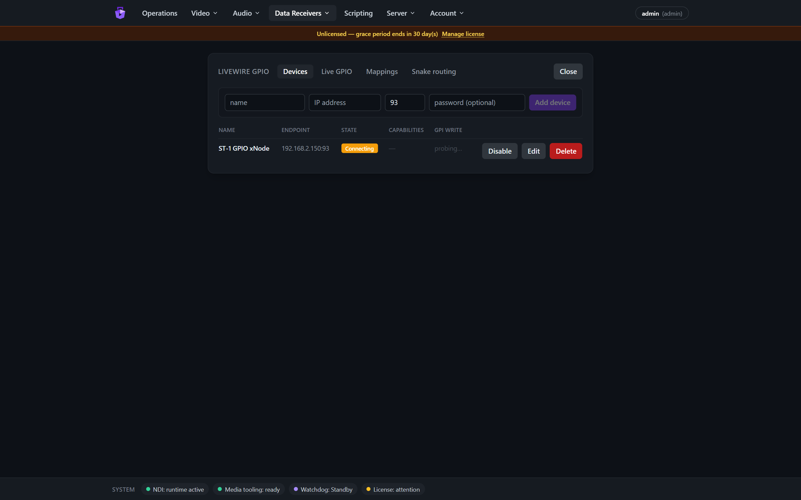

**Live GPIO** — pick a device to see the live pin grid (5 pins per port,
green = high; the display is the node's *confirmed* state). Operators can
simulate a GPI press on writable devices, and manually toggle GPOs — toggling
a pin owned by a status mapping prompts for an **audited override** (the
mapping is suspended, the pin gets an amber ring and a ⟳ release action). A
warning banner appears while the device is not connected (pin state may be
stale):

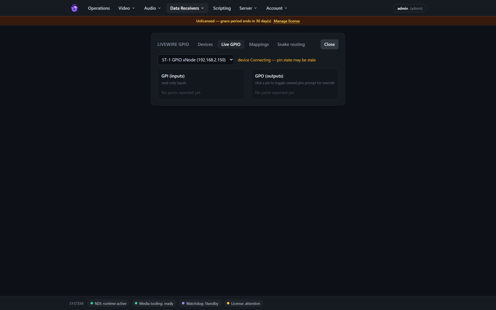

**Mappings** (admin) — the wiring between pins and channels. Both tables
lead with a **Live** lamp per row (green glow = active, dim = inactive,
hollow ring = no live state — device unconfirmed or a momentary event
source), so you can watch a mapping fire without leaving the page. The
channel pickers are grouped into video/audio, and the command/source lists
only offer what the selected channel's kind supports (the server refuses a
mismatch outright):

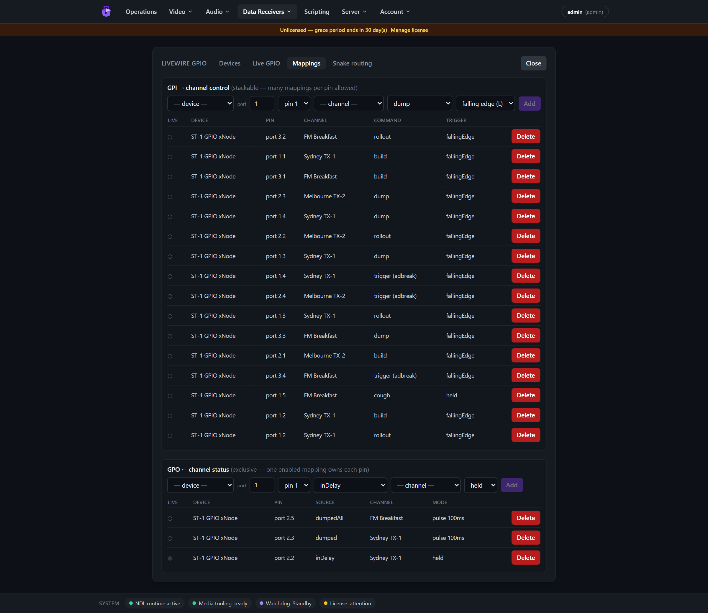

- **GPI → channel control** (stackable): device/port/pin → channel + command.
  Video commands `build | rollout | dump | trigger(adbreak) | censor |
  censorpost | forcecensoroff`; audio commands `build | dump | dumpall |
  exit | exitcompress | exitrollout | cough | censor | forcecensoroff |
  coughpost | censorpost`; and **delayed relays** `pulse1..10` /
  `static1..10` — a contact closure that re-emerges on a matching GPO source
  *delayed by the channel's current depth*, in sync with the delayed
  programme (DUMP cancels relays in the discarded span).
  Trigger edge: falling (default — momentary active-low is the broadcast
  norm, and means reconnects can never replay commands), rising, level
  high/low, or **held (on/off)** — the command is active while the pin is
  held and releases with it (offered for the cough/censor family; the
  post-output pairs are held-only). Held mappings are **level-reconciled**:
  the resolver fires whenever the pin's confirmed level disagrees with the
  last state it commanded, so a release edge lost to a dropped connection is
  corrected from the reconnect's seed indication instead of leaving a censor
  latched on — with the per-channel hold timeout as the final safety net.
  Adding a device offers a default template: port *n* pins 1–4 = channel *n*
  Build / Rollout / Dump / Trigger.
- **GPO ← channel status** (one enabled mapping owns each pin):
  - level sources — `inDelay` (the canonical "we are delaying" lamp —
    Building ∪ Delayed ∪ RollingOut), `stateBuilding` / `stateDelayed` /
    `stateRollingOut` / `stateLive`, `serverAlarm`, **`delaySafe`** (depth ≥
    one dump window), **`delayFull`** / **`delayEmpty`**, **`depth10` …
    `depth100`** (depth deciles — e.g. drive a 10-LED depth ladder),
    **`coughActive`** / **`censorActive`** / **`postCoughActive`** /
    **`postCensorActive`**, and `static1..10`;
  - event (pulse) sources — `dumped` (one pulse per DUMP, video **and**
    audio), **`dumpedAll`**, **`built`**, **`wentLive`**, and `pulse1..10`.
  - Mode `held` or `pulse` (default 100 ms).

GPI commands land on the same audited command queue as the web console and
TCP (50 ms per-channel debounce; **DUMP is exempt** from debounce).

**Snake routing** (admin) — continuously re-asserted GPI→GPO follows across
devices (source node pins → destination node pins with an offset). Heed the
warning: snake mode overrides any other routing controller (e.g. PathFinder)
on those pins.

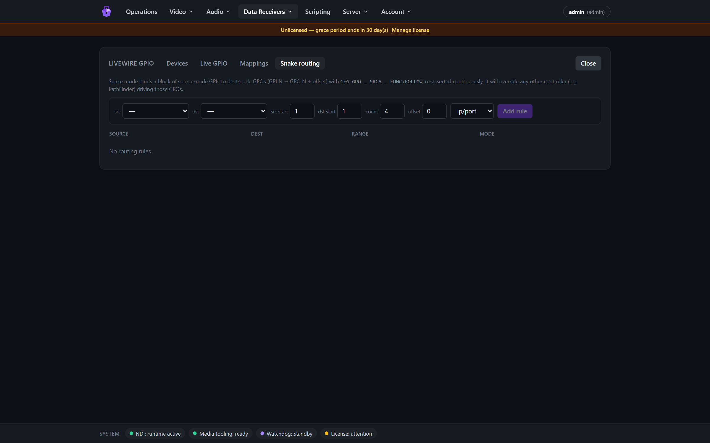

## 11. Data receivers and delayed data

**Data Receivers** ingests line- or chunk-framed data streams (now-playing
metadata, tickers, scoreboards…) and can **delay them through a channel so
the data re-emerges in sync with the delayed programme.**

Receiver kinds: **TCP Server** (listens), **TCP Client** (dials out, with
optional on-connect and keep-alive messages), **UDP Server**. Each has raw or
line framing, optional per-receiver file logging (directory and retention set
in Server settings), state pill, traffic counters and connected-client list:

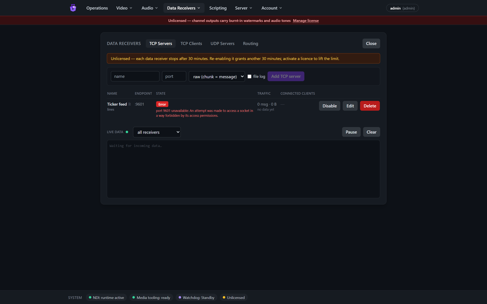

The **Live data** log at the bottom streams traffic in real time — received
messages (`⇢`), delayed releases (`⇠ released`, green) and connection events
— filterable per receiver, with Pause and Clear.

The **Routing** tab binds a receiver to a delay channel (video *or* audio;
or "passthrough" for no delay) plus an optional fixed offset, and fans out to
**sends**: TCP send, UDP send, or back out via an existing TCP receiver's
connections. Queue counters show `queued · sent`, plus `dumped` — **a DUMP on
the channel cancels the queued messages from the dumped span** so suppressed
content's metadata never leaks:

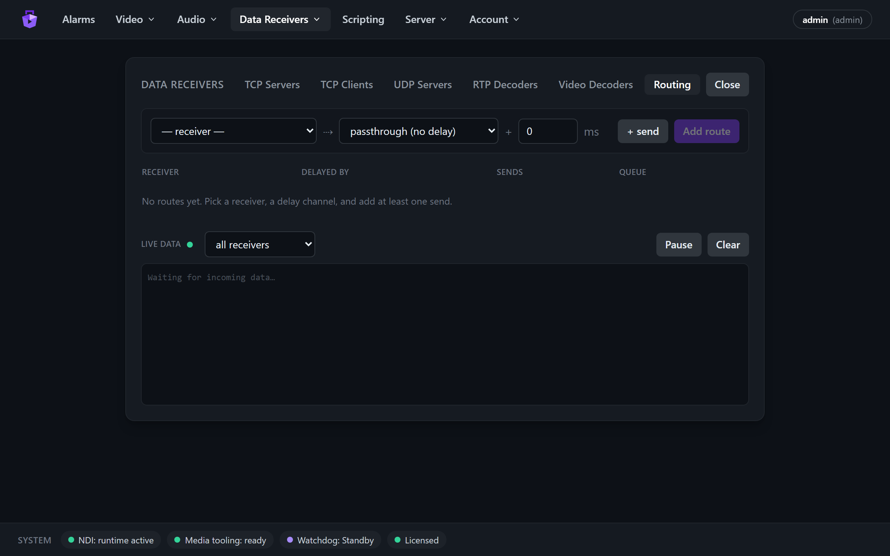

Incoming data can also fire scripts (`dataReceived`, `dataClientEvent`,
`dataDelayed` triggers — [§12](#12-scripting)).

**Unlicensed servers**: each enabled data receiver runs for **30 minutes at a
stretch**, then is disabled (audited as `RECEIVER_UNLICENSED_TIMEOUT`, with an
alert email). Re-enabling it grants another 30 minutes; activating a licence
lifts the limit entirely. An amber banner on the panel states exactly this
while the server is unlicensed ([§14](#14-licensing)).

## 12. Scripting

The **Scripting** view (admin only) hosts runtime automation scripts in
**Lua**, **JavaScript** or **C#**. Scripts run on the control plane only —
never the frame path — and everything they do passes the same command gate
and audit trail as the UI (`source = script`).

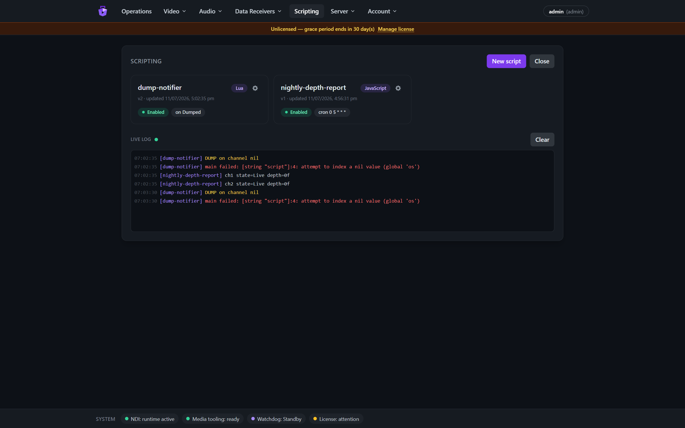

Each script card shows its language, enabled state, trigger summary and
version; the cog menu offers Edit / Run now / Enable / Delete. The **Live
log** streams script output and errors, colour-coded.

The editor (Monaco, with Ctrl-Space autocomplete for the `air` host API)
binds a script to a **trigger**: `manual`, `startup`/`shutdown`,
`channelEvent` (EnteredBuilding/EnteredDelayed/EnteredRollingOut/
ReturnedToLive/Dumped, optionally scoped to a channel), `audioEvent`,
`encoderEvent`, `audioEncoderEvent` (an audio streaming encoder going
Running/Down or firing a cue, [§16](#16-audio-streaming-encoders)), `gpi` (a
concrete LWRP device/port/pin and edge, any of them wildcarded), `status` (the GPO mapping level vocabulary — delaySafe,
stateLive, depth deciles, censor lamps, serverAlarm — firing when it
activates/deactivates), `scriptCompleted` (chain a script off another
script's completion, filtered by source script and success/failure;
loop-guarded so chains never revisit an ancestor and stop after 8 hops),
`scteReceived` / `scteAired` (an inbound SCTE cue as it is received or as it
reaches air, filtered by **Cue type** — spliceStart / spliceEnd / spliceCancel
— and channel; [§8](#8-the-encode-option-srtscte-35)), `scriptDelayed` (a
one-shot armed earlier from a script by `air.After`), `timer`, `schedule`
(cron), or the data triggers.
The **Examples** dropdown inserts a worked, compile-tested starting point
per language — timer + persistent counter, cron schedule, delay status
watchdog, GPI dump-all, parsing JSON/XML/binary payloads from data receivers,
and the SCTE recipes **SCTE: originate cues (all operations)**, **SCTE:
delay-aware ad break — arm** and **SCTE: delay-aware ad break — fire** (also
collected in [docs/scripting-examples.md](../scripting-examples.md)).

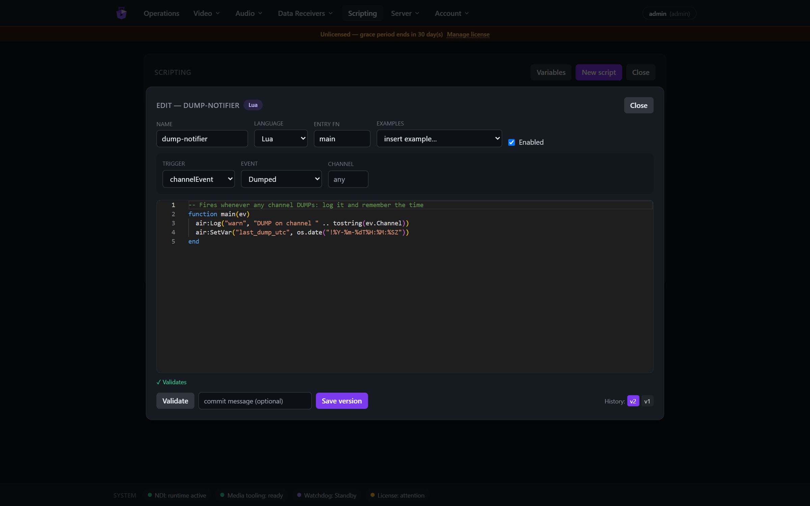

**Validate** checks the script; **Save version** creates an immutable
version, with an optional **commit message** stored against it. Clicking a
history chip (v1, v2, …) opens a read-only **side-by-side diff** of any two
versions — rollback is inspect-then-activate via the **Activate vN** button
in the diff header:

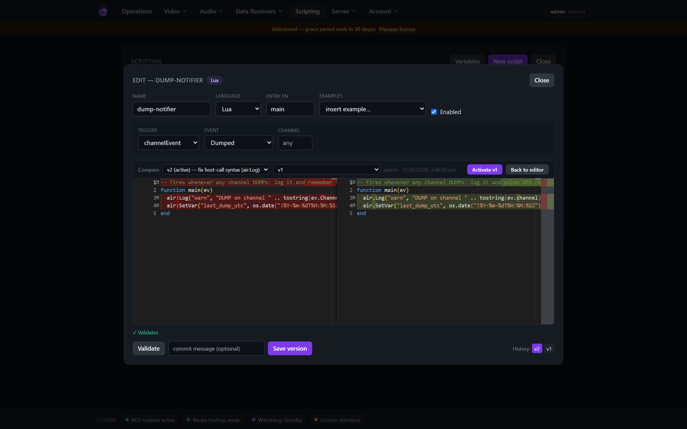

### Persistent variables

Scripts have no memory between runs by design (each invocation is a fresh,
~1-second-budget call). **Persistent variables** are the sanctioned way to
carry state: a single key/value store that is

- **shared by all scripts in all three languages** — one flat namespace, so a
  Lua script's counter is readable by a JavaScript script (adopt a naming
  convention like `heartbeat.count` to keep things tidy);
- **persistent** — the values are database rows, so they survive script
  edits, disables and full server restarts;
- **replicated** — on a redundancy pair the store syncs to the backup, so a
  takeover keeps your state.

The host API (Lua uses colon syntax, JS/C# dot/bare):

| Call | Returns |
|---|---|
| `air:GetVar("name")` | the value as a string, or nil/null when absent |
| `air:SetVar("name", value)` | — (creates or overwrites) |
| `air:GetNumber("name")` | the value parsed as a number, or nil/null when absent **or unparseable** |
| `air:GetBool("name")` | true/false (accepts `true/false`, `1/0`, `yes/no`, `on/off`), else nil/null |
| `air:DeleteVar("name")` | — (no-op when absent) |

The typed getters return nil rather than throwing, so defaults compose
naturally:

```lua
-- Bind with trigger "timer" (e.g. every 5000 ms).
function main(trigger, channel, event, args)
  local n = (air:GetNumber("heartbeat.count") or 0) + 1
  air:SetVar("heartbeat.count", tostring(n))
  air:Log("info", "tick " .. n .. " — video ch1 is " .. air:State(1))
end
```

Values are always **stored and transported as text** — the *type* column in
the UI (string · number · bool · json) is a validation hint for the editing
form, not a storage format. Every write is audited: script writes as
`SCRIPTVAR_SET` with source `script` and the script's name as principal,
console/REST writes with source `rest` and the signed-in user. Reads are not
audited.

The **Variables** button on the Scripting page opens the store for
inspection and editing (admin) — add/update with per-type validation, edit
or delete any row, see when each was last written. The script editor
autocompletes existing variable names whenever the cursor is inside the
string argument of `GetVar`/`SetVar`/`GetNumber`/`GetBool`/`DeleteVar`:

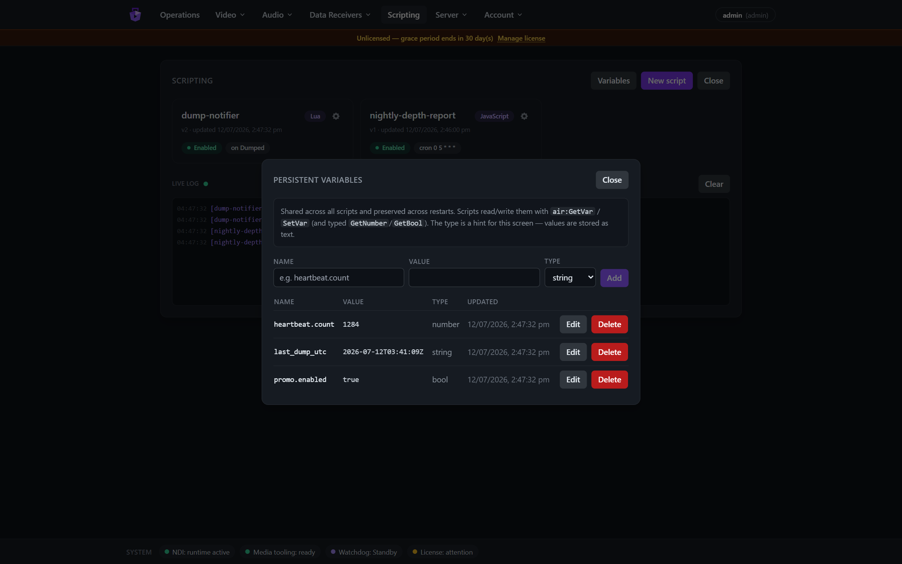

The host API covers channel transport and status, audio-delay commands,
encoder control, SCTE cue origination — including per-call overrides
`air.Trigger(ch, template, {operation, preRollMs, breakDurationMs})` and
`air.After(ms, id)` one-shots that fire a `scriptDelayed` trigger, audio
streaming-encoder cue control (`air.AudioEncoderCue(id, "out"|"in", seconds)`)
— GPIO, persistent variables, logging and alerts. There is deliberately no sleep — use timer/schedule triggers; each
invocation has a 1 s timeout. Lua and JavaScript are sandboxed; **C# runs
full-trust** — treat it like server-side code. Full reference and examples:
[docs/scripting-guide.md](../scripting-guide.md).

**Unlicensed servers**: each enabled script runs for **30 minutes at a
stretch**, then is disabled (audited as `SCRIPT_UNLICENSED_TIMEOUT`, with an
alert email). Re-enabling grants another 30 minutes; a licence lifts the
limit ([§14](#14-licensing)). The Scripting panel shows an amber banner while
the limit is in force.

> Note the host-call syntax in Lua is colon-style: `air:Log(...)`,
> `air:Build(1)` — while JavaScript and C# use dot-style (`air.Log(...)`).

## 13. Server administration

### 13.1 General settings (Server → General)

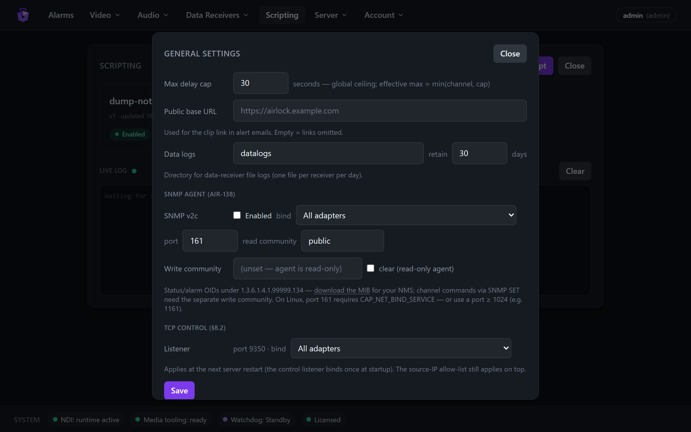

- **Max delay cap** — global ceiling in seconds (1–300; default 30). A
  channel's effective window is min(its own max, this cap).
- **Public base URL** — the host used in alert-email clip links (empty =
  links omitted); also the base for the OIDC redirect URI.
- **Data logs** — directory and retention (days) for data-receiver file logs.

### 13.2 Email (Server → Email (SMTP))

Alert email for DUMP notifications (and system alerts such as licence and
runtime-limit warnings): server, port, security (STARTTLS 587 / SSL 465 /
none), optional auth (password write-only), From address/name, and a
**Send test email** button.

### 13.3 Authentication (Server → Authentication)

External sign-in; the internal login always remains as break-glass.

- **LDAP / Active Directory** — server/port + security (LDAPS/StartTLS/none),
  service bind DN + password, base DN, user filter (default
  `(sAMAccountName={0})`), role mappings (`role: group-DN`, one per line,
  first match wins), default role or "refuse unmapped users".
- **OIDC SSO** (Entra ID / Okta / Keycloak…) — authority, client id/secret,
  scopes, role claim (default `groups`), role mappings, default role, button
  label. Register the redirect URI `<public base URL>/api/auth/oidc/callback`
  with the IdP.

How the OIDC pieces fit (applies to any provider): Airlock runs the standard
authorization-code flow against the provider's discovery document
(`<authority>/.well-known/openid-configuration`) and reads everything **from
the ID token**. The signed-in username is the token's `preferred_username`
claim, falling back to `email` then `sub`. Role mapping looks at every value
of the configured **role claim** and applies the mapping lines in order —
`role: value`, exact match (case-insensitive), **first match wins**; if
nothing matches, the user gets the **default role**, or is refused when the
default is "refuse unmapped users". Directory users appear under Server →
Users after their first sign-in, re-deriving their role at every login
unless an admin pins it ([§13.4](#134-users-server--users)).

#### Worked example — Microsoft Entra ID (Azure)

In the **Entra admin center** (entra.microsoft.com):

1. **Identity → Applications → App registrations → New registration.** Name
   it (e.g. "Airlock"), keep *Accounts in this organizational directory
   only*, and under **Redirect URI** pick platform **Web** and enter exactly
   the URI Airlock shows at the bottom of its Authentication panel:
   `https://<public base URL>/api/auth/oidc/callback`.
2. From the app's **Overview**, note the **Application (client) ID** and the
   **Directory (tenant) ID**.
3. **Certificates & secrets → New client secret** — copy the secret's
   *Value* immediately (it is only shown once).
4. **Token configuration → Add groups claim** → tick **Security groups** for
   the **ID** token. Entra emits group **object IDs (GUIDs)**, not names —
   copy each relevant group's Object ID from *Groups → your group →
   Overview*. If your users belong to many groups, choose **"Groups assigned
   to the application"** instead and assign just the Airlock-relevant groups
   under *Enterprise applications → Airlock → Users and groups* — this keeps
   the claim small (Entra drops the claim entirely for users in 200+ groups)
   and doubles as an access list.

In **Airlock (Server → Authentication → OIDC SSO)**:

| Field | Value |
|---|---|
| Authority | `https://login.microsoftonline.com/<tenant-id>/v2.0` |
| Client ID / secret | from steps 2–3 |
| Scopes | `openid profile email` (the default) |
| Role claim | `groups` |
| Role mappings | `admin: <object-id of your admins group>`<br>`operator: <object-id of your operators group>` — one per line |
| Default role | `viewer`, or "refuse unmapped users" to admit only mapped groups |
| Button label | e.g. `Microsoft` |

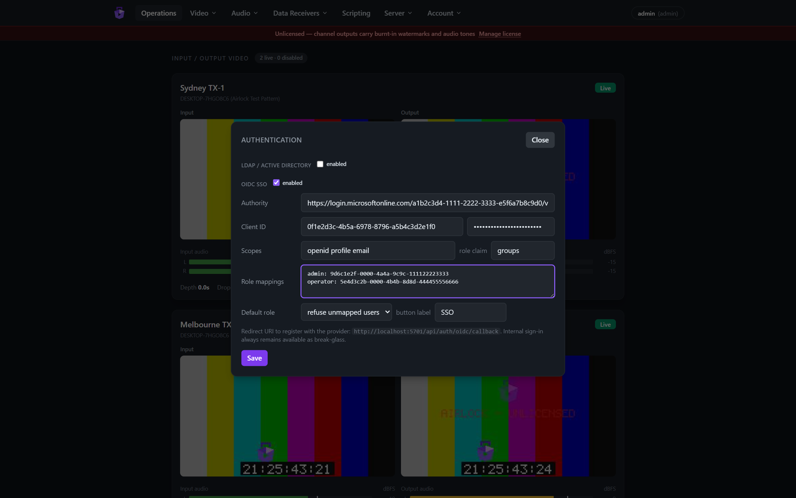

Users sign in with the login button and land under their UPN (Entra's
`preferred_username`). If sign-in fails with "no role mapping matched",
the group claim isn't reaching the ID token — re-check step 4 and that the
user is in an assigned group.

#### Worked example — Google Workspace

Google's ID tokens **do not carry a groups claim**, so Workspace group
membership can't drive roles directly — map on the `email` claim (or the
`hd` hosted-domain claim) instead, and use the sticky role override in
Server → Users for individual promotions.

In the **Google Cloud console** (console.cloud.google.com), in any project:

1. **APIs & Services → OAuth consent screen** — set User type **Internal**.
   This restricts sign-in to accounts in your Workspace domain and is doing
   real access control: with an *External* consent screen, any Google
   account could sign in and would receive your default role.
2. **APIs & Services → Credentials → Create credentials → OAuth client ID**
   — application type **Web application**, and add the Airlock callback as
   an **Authorised redirect URI**:
   `https://<public base URL>/api/auth/oidc/callback`. Copy the client ID
   and secret.

In **Airlock (Server → Authentication → OIDC SSO)**:

| Field | Value |
|---|---|
| Authority | `https://accounts.google.com` |
| Client ID / secret | from step 2 |
| Scopes | `openid profile email` (the default) |
| Role claim | `email` |
| Role mappings | `admin: dan@station.example`<br>`operator: mcr@station.example` — one line per person |
| Default role | `viewer` (every Workspace user can watch), or "refuse unmapped users" |
| Button label | e.g. `Google` |

Users land under their email address. Two workable patterns for roles:

- **Per-person mappings** (above) — explicit, auditable, but a list to
  maintain.
- **Domain default + pinned exceptions** — set role claim `hd` (Google's
  hosted-domain claim) with a single mapping like
  `operator: station.example` so everyone in the domain operates, then
  promote the few admins via the **override** pin in Server → Users
  ([§13.4](#134-users-server--users)); the pin survives every login.

Whichever provider you use, the internal username/password login stays
available as break-glass — an IdP outage can't lock you out of the console.

### 13.4 Users (Server → Users)

Full user management lives in the console:

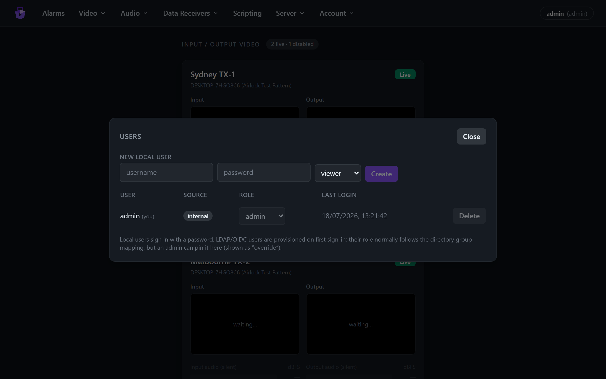

- **Local users** — create with username/password/role; change roles from the
  per-row dropdown; delete. You cannot change your own role or delete your
  own account. Everyone can change their own password via **Account →
  Change password**.
- **Directory users** (LDAP/OIDC) are provisioned automatically on first
  sign-in, tagged with their source. Their role normally follows the
  directory group mapping on every login — but an admin can **pin it**: set a
  role from the dropdown and it becomes a sticky override (tagged
  **override ✕**; the directory mapping is ignored until you click the ✕ to
  hand the role back, which re-applies at the user's next login). Untouched
  directory users show a grey **directory** tag.
- Role changes are audited (`USER_ROLE_SET` / `USER_ROLE_MANAGED`) and users
  replicate to redundancy backups.

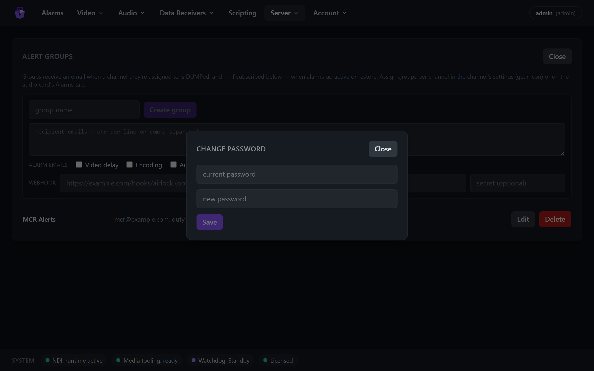

### 13.5 Audit and backup

The audit log is append-only and viewable at the bottom of Operations (full
history via `GET /api/audit?from&to&ch&skip&take`). A checkpointed copy of
the configuration database can be downloaded by admins from
`GET /api/server/backup` (API-only).

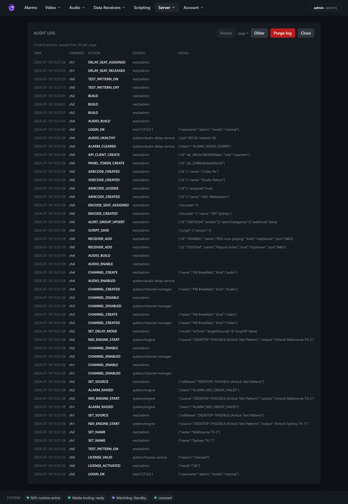

### 13.6 Watchdog

A separate watchdog process monitors the server's heartbeat and can take over
the NDI output names in a failover pair **on the same host**. Its state shows
in the footer. **Fail-back is operator-confirmed by default**
(`POST /api/server/failback`, operator role) so a recovered primary never
glitches live programming unannounced. For a second, geographically separate
server, see Redundancy below — the two mechanisms are independent.

### 13.7 Redundancy (primary/backup)

**Server → Redundancy** configures a warm-standby pair: a **primary (master)**
serves configuration, users and media to one or more **backups** over a
`/ws/sync` link secured by a shared **sync key** (generated once on the
primary — *"shown once — paste into each backup"*). Fill and audio-fill
assets mirror automatically.

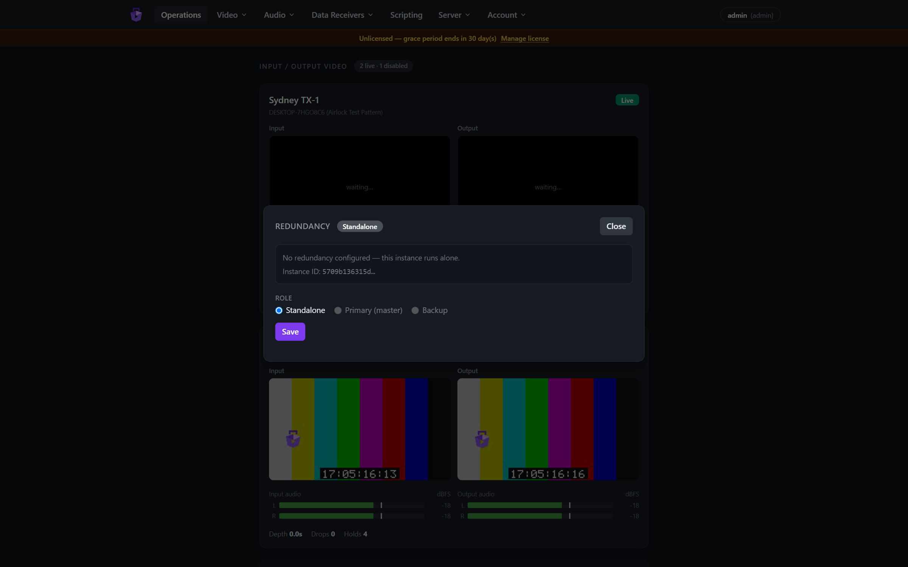

- **Roles** are gated by licence feature flags: only a licence carrying
  **PRIMARY** can serve backups, only one carrying **BACKUP** can join as a
  backup (the radios are greyed otherwise — the screenshot above shows a
  standalone instance). The role is also **enforced by the licence itself**:
  running under a redundancy role the installed licence doesn't permit makes
  the licence invalid until the role or the licence is corrected
  ([§14](#14-licensing)). Role and sync settings are admin; takeover/rejoin
  are operator actions.
- A **synced backup is locked**: the whole console is read-only (buttons
  greyed, REST mutations refused, TCP verbs answer `ERR … LOCKED`), and its
  alert emails, GPO drives and data-route sends are suppressed so nothing
  fires twice. Its NDI outputs run under a configurable **name suffix**.
- **Master lost**: the backup unlocks local control for a sealed **14-day
  window** (staged warning emails; banner countdown). Local changes are
  discarded when the master returns. At expiry controls re-lock — except
  **DUMP and ROLLOUT, which always remain available**.
- **Take over — adopt primary NDI names** (operator-confirmed, only while the
  master is unreachable): the backup renames its outputs to the primary's NDI
  names so downstream receivers cut over. **Rejoin as backup** reverts the
  names, re-locks and resyncs (the master's configuration wins).
- The backup's state is always visible: the footer **Redundancy** pill, the
  banners, and the panel's live status (with the primary's **Connected
  backups** table on the master).

### 13.8 API access (Server → API access)

External systems call the same REST API as the console, authenticating with
the **OAuth2 client-credentials grant**. The API access panel creates named
**API clients**, each bound to a role (viewer/operator/admin); the client
secret is shown **exactly once** at creation — copy it then, only a hash is
stored. Clients can be disabled or deleted (deleting one makes its
integrations fail to obtain tokens immediately). **Open Swagger ↗** jumps to
the interactive API reference.

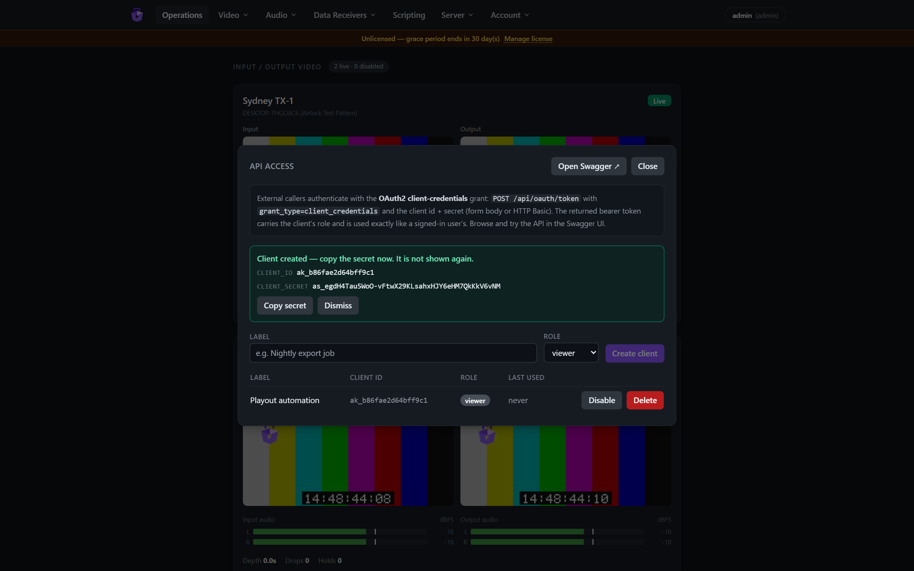

Client management is admin (and master-only on a redundancy pair, though the
clients replicate and tokens keep working on a locked backup — integrations
survive takeover). Details of the token flow: [§15](#15-remote-control-tcp-protocol-and-rest).

### 13.9 Panel control (Server → Panel control)

Hardware panels — **Elgato Stream Deck** and **Bitfocus Companion** — drive
delay channels directly, showing live state on their keys and firing transport
commands with a physical press. They connect to Airlock over a **dedicated
line-delimited-JSON TCP port** (default **9351**, separate from the automation
TCP port in [§15](#15-remote-control-tcp-protocol-and-rest)), and the feature
is gated by the **`PANEL`** licence flag ([§14](#14-licensing)).

**Server → Panel control** (admin) enables the listener and manages the
connection tokens the panels authenticate with:

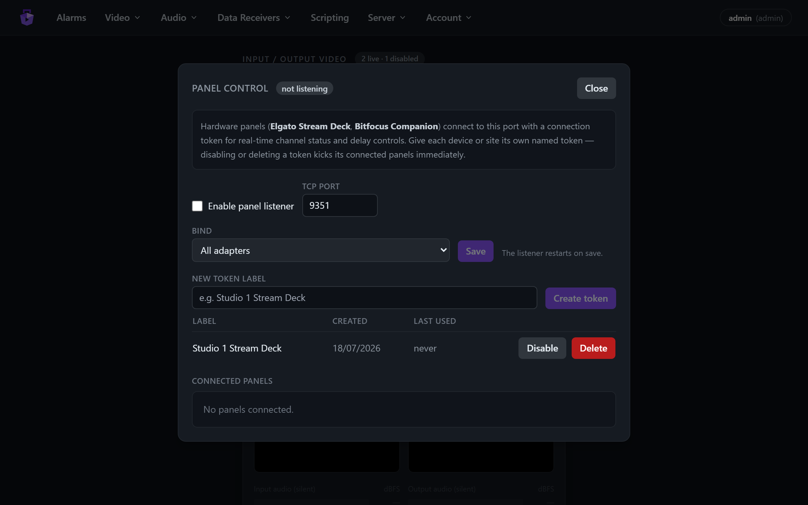

*(Captured on an unlicensed evaluation server, so the amber banner and the
status-only state are showing — see the licensing note below. With the `PANEL`
feature licensed the banner clears and panel commands are accepted.)*

- **Enable panel listener** + **TCP port** — turn the listener on and choose
  the port; **Save** applies it (*"The listener restarts on save."* — no
  service restart needed, and the port must be 1–65535 and different from the
  automation TCP port). The heading pill reads **listening on :9351** when the
  listener is up, **not listening** otherwise.
- **Named connection tokens** — give each device or site its own token: type a
  **New token label** (e.g. *Studio 1 Stream Deck*) and **Create token**. The
  secret is shown **exactly once**, in a banner — *"Token "…" created — copy it
  now. It is not shown again."* — with **Copy token** / **Dismiss**; only a
  hash is stored:

  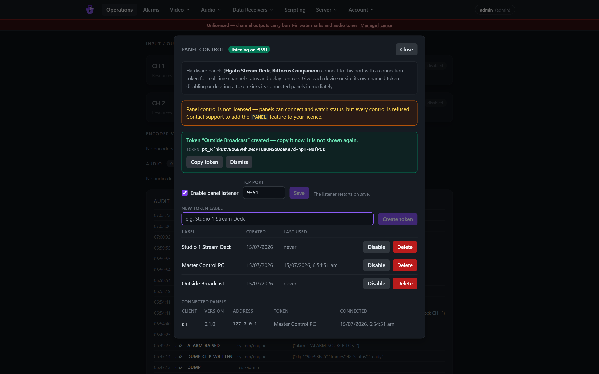

  Existing tokens list in a table (**Label · Created · Last used**) with
  **Disable**/**Enable** and **Delete** per row. **Disabling or deleting a
  token disconnects its live panels immediately** (delete confirms *"Delete
  panel token "…"? Every panel using it is disconnected immediately. This
  cannot be undone."*), so a lost or decommissioned device is re-keyed on its
  own without disturbing the rest of the fleet. Until a token exists, *"No
  tokens yet — panels cannot connect until one is created."*
- **Connected panels** — a live table of attached panels (**Client · Version ·
  Address · Token · Connected**), so you can see which device used which token.

The token collection **replicates to redundancy backups** (so panels keep
working after a takeover), while the enabled flag and port stay
machine-local — a backup operator enables the backup's own listener. On a
locked backup, panels still stream status but their commands are refused the
same way the TCP surface is (exits stay live under the
exits-only lock; [§13.7](#137-redundancy-primarybackup)). **Unlicensed**, the
listener is *status-only*: panels connect and watch state, but every command is
refused — the modal shows *"Panel control is not licensed — panels can connect
and watch status, but every control is refused. Contact support to add the
`PANEL` feature to your licence."*

**Setting up a panel.** Both plugins are pointed at the same three things — the
server's **IP / host**, the **panel port**, and a **connection token** minted
above. In the Stream Deck app, the **Airlock** category offers two key types:

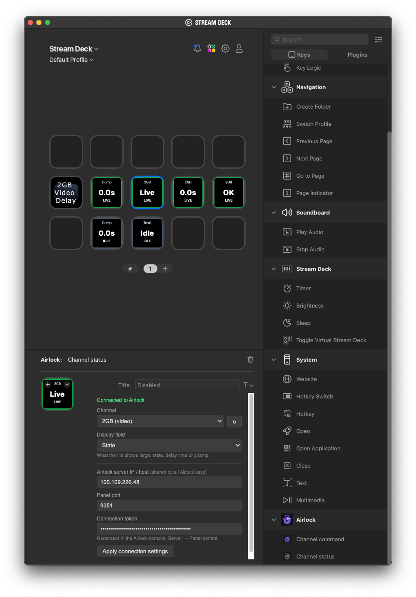

- **Channel status** — a live status tile. Pick the **Channel** and a
  **Display field** (**State**, **Delay time**, **Censor lamp** or **Alarms**);
  the whole key face renders the value and recolours with channel state
  (a green **Live**, the delay depth, an alarm lamp). The property inspector
  shows **Connected to Airlock** once the IP/port/token are applied.

  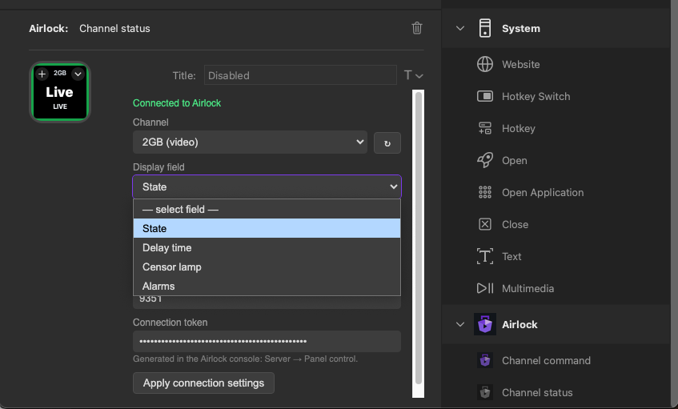

- **Channel command** — a command key. Pick the **Channel** and a **Command**;
  the key doubles as a live status face. The command list is filtered to the
  channel's kind (*"Commands are filtered to the channel's kind (video /
  audio)."*) and covers the full transport set — **Build delay**, **Dump**,
  **Dump all**, **Exit (jump cut / compress / rollout)**, the **Cough** and
  **Censor** holds and one-shots, their post-delay variants and **Force censor
  off**:

  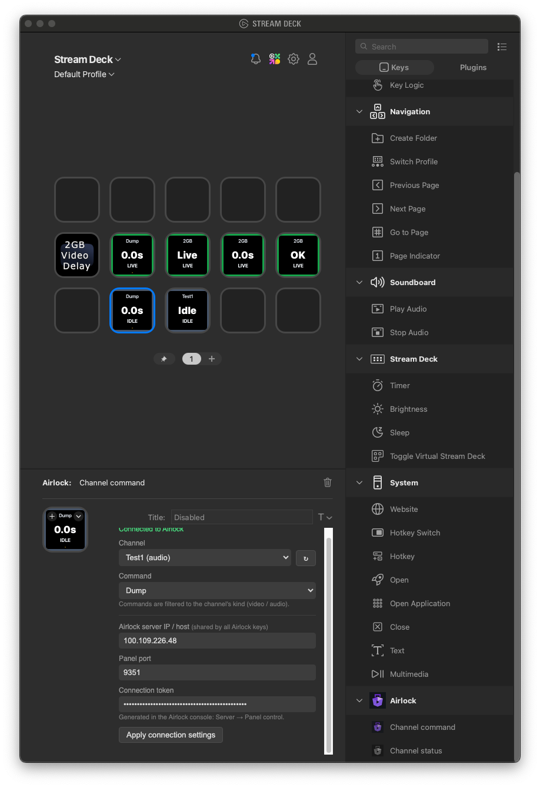
  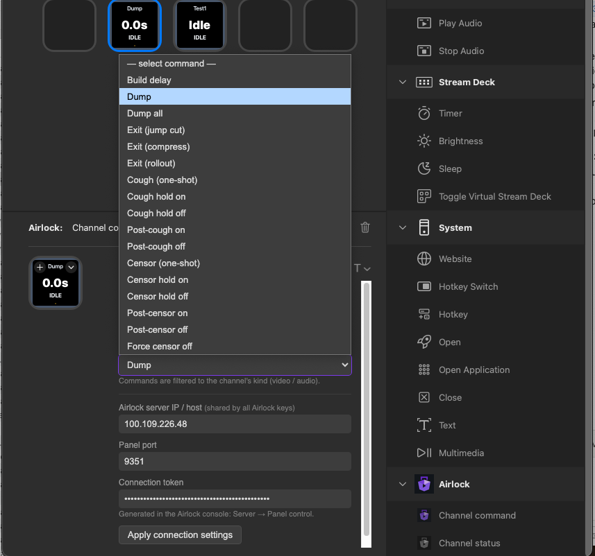

The connection fields are shared by all Airlock keys; the token box is filled
from **Server → Panel control** (*"Generated in the Airlock console: Server →
Panel control."*). **Bitfocus Companion** carries the same surface as a module:
a kind-filtered channel-command action, state/censor/cough/alarm/lock/licence
feedbacks, and per-channel variables and presets. A command a panel is not
allowed to run (unlicensed, locked backup, or illegal for the current state)
dims on the key rather than firing. Every panel command passes the same
state-legality gate and audit trail as the console (`source = panel`).

## 14. Licensing

The licensing model in one sentence: **a licence buys clean outputs and
unlimited runtime — it never gates the delay itself.** BUILD, ROLLOUT and
DUMP work identically on licensed and unlicensed servers; what changes is
watermarking and (for receivers/scripts) a runtime limit.

**Server → License** is the control panel for all of it:

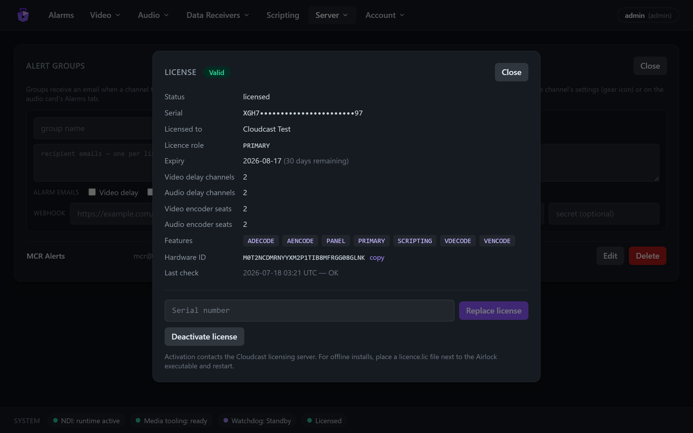

### What a licence grants

Five independently licensed seat pools, carried as feature strings on the
licence: **video delay channels** (`CHANNELS=n`), **audio delay channels**
(`AUDIO=n`), **video encoder seats** (`ENCODE=n`, bare `ENCODE` = unlimited),
**audio streaming-encoder seats** (`AENCODE=n`, [§16](#16-audio-streaming-encoders))
and **audio decoder seats** (`ADECODE=n`, [§17](#17-audio-decoders-and-rtp-transport))
— plus boolean feature flags shown in the **Features** row, e.g. **`PANEL`** for
the Stream Deck / Companion panel interface
([§13.9](#139-panel-control-server--panel-control)) and **`XHEAAC`** for xHE-AAC
HLS renditions ([§16](#16-audio-streaming-encoders)). Trial licences
are tagged **(demo)** and default to one video channel unless the trial carries
explicit counts. A licence counts as a trial only when its demo flag rides an
**enabled expiry date** — a perpetual licence (no expiry) is treated as a full
licence even if the vendor marked it demo.

Two flags matter operationally: **PRIMARY** and **BACKUP** gate the
redundancy roles ([§13.7](#137-redundancy-primarybackup)) — and they are
*enforced*: a role-flagged licence used under a role it doesn't permit makes
the whole licence invalid (banner: *"this backup licence does not permit the
primary role — change the redundancy role or activate a matching licence"*).
PRIMARY covers primary and standalone; BACKUP covers backup only; a licence
with no role flags is unrestricted. Role-flagged licences show a **Licence
role** row in the panel. Activating a serial that permits **only the backup
role** switches this server into the backup redundancy role as part of
activation — the console locks and standalone/primary operation is disabled,
and you then set the master connection on the Redundancy page
([§13.7](#137-redundancy-primarybackup)); over the REST activation API this
switch is an explicit confirm step (`confirmRoleSwitch`).

### Activation paths

1. **Console, online** — enter the serial, **Activate** (or **Replace
   license** over an existing one). Activation contacts the Cloudcast
   licensing server and binds to this machine's **Hardware ID** (shown in the
   panel with a copy button — quote it when requesting a licence).
2. **Trial** — when no serial is registered, **Start trial** with an email
   address. The confirmation link in the email completes it.
3. **Install time** — the MSI's SERIAL field ([§2](#2-getting-started)). The
   serial is parked in the registry and consumed at the service's first
   start; while the licensing server is unreachable it retries daily, and a
   definitively rejected (e.g. mistyped) serial stops retrying and raises an
   alert email instead.
4. **Offline** — place a `licence.lic` file next to the Airlock executable
   and restart.

### Staying licensed: the daily check and the offline allowance

An activated server re-validates against the licensing server **once a
day** (first check ~1 minute after startup). Three outcomes:

- **Reachable and valid** — nothing to see; the failure counter resets.
- **Unreachable** — the failure counter ticks up. The server tolerates
  **30 consecutive failed daily checks** — roughly a month of full offline
  operation. The panel row reads "N consecutive failed daily check(s)
  (allowance 30)", the banner shows "License server unreachable (N/30
  days)", and warning emails start going out in the last week of the
  allowance. Past 30, the licence goes invalid ("licensing server
  unreachable for N days") until connectivity or a manual re-activation
  restores it — any single successful check resets the counter to zero.
- **Rejected** (expired / revoked / invalid) — the licence is invalidated
  immediately, and the verdict sticks until a later check or re-activation
  succeeds.

A licence with an expiry date also lapses locally on that date regardless of
connectivity ("perpetual" licences show no expiry). Every validity
transition is audited (`LICENSE_VALID` / `LICENSE_INVALID`) and emailed once.

### What unlicensed / invalid actually means

There is **no grace period**: from the moment a server has no valid licence
(fresh install, expiry, revocation, deactivation, exhausted offline
allowance, role mismatch) enforcement applies immediately —

- **Every delay channel's output is watermarked**: video carries the Airlock
  mark + "AIRLOCK — UNLICENSED" burnt into the frame (the previews show the
  composited output — what you see is what airs) plus periodic tone bursts
  on its audio; audio delay channels play a ~1-second tone burst every 30
  seconds of output; encoder feeds carry "AIRLOCK — ENCODE UNLICENSED". The
  header banner reads *"Unlicensed — channel outputs carry burnt-in
  watermarks and audio tones"* and the licence panel's capability rows show
  "0 — outputs watermarked" / "0 — outputs carry tones".
- **Data receivers and scripts run 30 minutes at a stretch**: each enabled
  receiver and each enabled script is disabled 30 minutes after it was
  enabled (audited `RECEIVER_UNLICENSED_TIMEOUT` /
  `SCRIPT_UNLICENSED_TIMEOUT`, one alert email, amber banners on both
  panels). Re-enabling an item grants it a fresh 30 minutes; there is no
  countdown in the UI. The delay channels themselves have no runtime limit —
  they watermark instead.
- **Nothing operational is refused**: Build/Roll out/Dump, GPIO, TCP and
  the audio delay all keep working. The design intent is that an unlicensed
  Airlock is fully evaluable and fails *loud*, never *dangerous*.

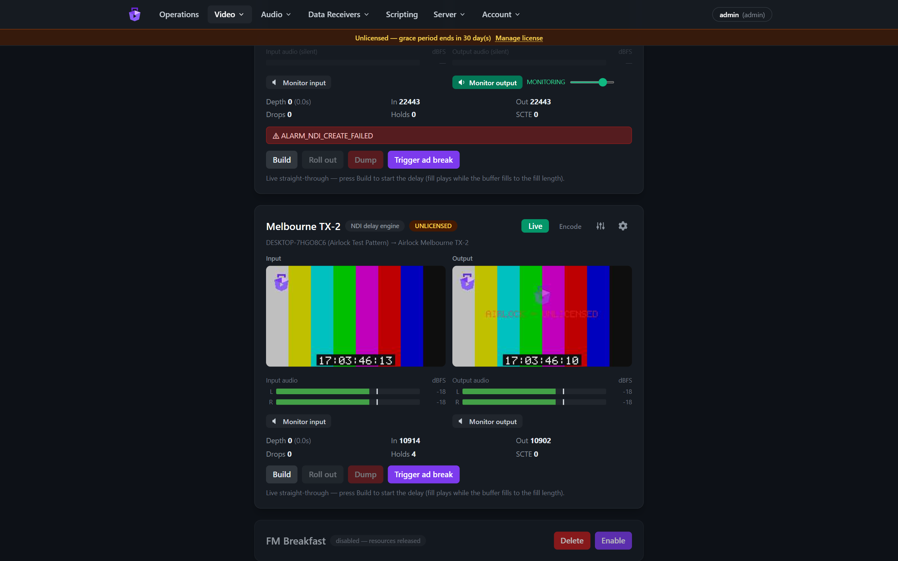

### Seats

On a licensed server, the capability counts are **seats** that admins spread
across channels: the pill next to each channel name assigns (amber
**UNLICENSED**) or releases (grey **licensed**) a seat, and the Encoders page
does the same for encoder seats. Seats are honoured **lowest channel id
first** up to the licensed count — so if a replacement licence carries fewer
seats than are assigned, the highest-numbered channels lose theirs (and
start watermarking) first. All watermark changes take effect **live, on
air, within seconds** — assigning a seat, activating a licence or letting
one lapse never interrupts the programme; the video engine flips its
watermark in place, while audio channels and encoders briefly reconfigure.

Deactivating (panel button, confirm: *"Deactivate this license? Channel
outputs will immediately carry burnt-in watermarks and audio tones."*) drops
straight to the unlicensed behaviour above.

*(The redundancy backup's 14-day local-control window
([§13.7](#137-redundancy-primarybackup)) is a separate mechanism — it
governs control lockout on a backup that lost its master, never
watermarking.)*

## 15. Remote control: TCP protocol and REST

### TCP control (automation LAN)

A plain line-oriented TCP protocol listens on **port 9350** (UTF-8, CRLF,
`OK`/`ERR` replies). It is **unauthenticated by design** — restrict it to the
management/automation LAN (there is an allow-list; default localhost only).

```
BUILD <ch>      ROLLOUT <ch>     DUMP <ch>      TRIGGER <ch> <template> [k=v …]
DUMPALL <ch>    EXIT <ch>        COUGH <ch>     CENSOR <ch>          (audio)
STATE <ch>      SUBSCRIBE <ch>   PING
```

`SUBSCRIBE` streams `TALLY <ch> <State>` on every state change plus
`ALARM <ch> <code>` lines. Commands pass the same state-legality gate and
audit trail as the UI (`source = tcp`), so e.g. `BUILD` on a Delayed channel
returns `ERR … ERR_INVALID_STATE`. On a synced backup, mutating verbs answer
`ERR <ch> LOCKED …` (after the 14-day window expires, DUMP/DUMPALL/EXIT/
ROLLOUT still work — everything else is refused).

A separate line-delimited-JSON TCP surface serves **hardware panels** (Stream
Deck / Companion) on its own token-authenticated port — see
[§13.9](#139-panel-control-server--panel-control).

### REST, OAuth2 and Swagger

Everything in the console is REST + JWT underneath (`POST /api/auth/login` →
bearer token). **External integrations** should instead use an API client
([§13.8](#138-api-access-server--api-access)) with the OAuth2
client-credentials grant: `POST /api/oauth/token`
(`application/x-www-form-urlencoded`, `grant_type=client_credentials`,
credentials as form fields or HTTP Basic) returns a Bearer token carrying the
client's role (8 h expiry; standard RFC 6749 error envelopes; rate-limited
10/min/IP; issuance is audited and **keeps working on a locked redundancy
backup**, so integrations survive takeover).

The interactive API reference lives at **`/swagger`** (OpenAPI JSON at
`/swagger/v1/swagger.json`) — browsable without signing in; "Try it out"
needs a pasted bearer token or the built-in OAuth2 flow in the Authorize
dialog:


Highlights: `GET /api/channels`,
`POST /api/channels/{n}/build|rollout|dump|trigger` (dump requires body
`{"confirm": true}`), audio actions
`POST /api/channels/{n}/audio/{action}` (build, dump, dumpall, exit,
exitcompress, exitrollout, cough on/off, censor on/off, forcecensoroff, and
the post-delay `coughposton/off` / `censorposton/off`), audio processing
`PUT /api/channels/{n}/audio-processing` and `/encode-audio-processing`,
video censor `POST /api/channels/{n}/censor/{censor|censoron|censoroff|
censorposton|censorpostoff|forcecensoroff}` (operator) +
`GET/PUT /api/channels/{n}/censor-config` (admin),
redundancy `GET/PUT /api/redundancy` + `takeover`/`rejoin`, API clients
`GET/POST /api/api-clients`, script variables `GET /api/script-vars` +
`PUT/DELETE /api/script-vars/{name}`, video fill schedules
`GET/POST /api/channels/{n}/fill-schedule` +
`DELETE .../fill-schedule/{id}` (operator), users
`GET/POST/DELETE /api/users` + `POST /api/users/{id}/role` +
`DELETE /api/users/{id}/role-override` (admin), ASIO discovery
`GET /api/audio/devices[/{name}/channels]`, live mapping state
`GET /api/lwrp/mappings/status`, alarms `GET /api/alarms` (+
`/api/alarms/history`), per-channel silence detection
`GET/PUT /api/channels/{n}/silence-detect`, SCTE policy
`GET/PUT /api/channels/{n}/scte-policy` and live block
`POST /api/channels/{n}/scte-block/{on|off}`, alarm alert-group assignment
`POST /api/channels/{n}/alarm-alert-groups`, alert-group webhook test
`POST /api/alert-groups/{id}/webhook-test`, panel control
`GET/POST /api/panel/tokens` (+ `POST .../{id}/enabled`, `DELETE .../{id}`) and
`GET /api/panel/status`, audio streaming encoders
`GET/POST /api/audio-encoders` (+ `/{id}` config, `/{id}/enable`,
`/{id}/license`, `/{id}/status`, `/{id}/cue`, `/{id}/audio-processing`; codec
profiles `GET /api/audio-encoders/codec-profiles`), audio decoders
`GET/POST /api/audio-decoders` (+ `/{id}` config, `/{id}/enable`,
`/{id}/license`, `/{id}/status`, `/{id}/audio-processing`), `GET /api/audit`,
`GET /api/metrics`,
`GET /api/server/status`. WebSockets (token via `?access_token=`) carry
telemetry, previews, audio monitoring and the log streams.

## 16. Audio streaming encoders

Airlock can take an audio-delay channel's output — or an **external NDI audio
source** — and stream it out as **AAC over RTMP or HLS**, **MP3 / AAC / Opus
over Icecast/SHOUTcast**, or a raw codec over **RTP** to another Airlock. This
is a distinct subsystem from the video **Encode option** ([§8](#8-the-encode-option-srtscte-35)):
its own supervised child process family (`Airlock.AudioEncode`) and its own
licence seat pool, **`AENCODE`** ([§14](#14-licensing)). It is managed from
**Audio → Encoders**.

### The Audio Encoders page

**Audio → Encoders** lists one card per encoder; the header shows **{n} / {total}
licence seats used** (`∞` when uncapped). **+ Add encoder** takes a name and
**Create**s it; until then, *"No audio encoders yet."*

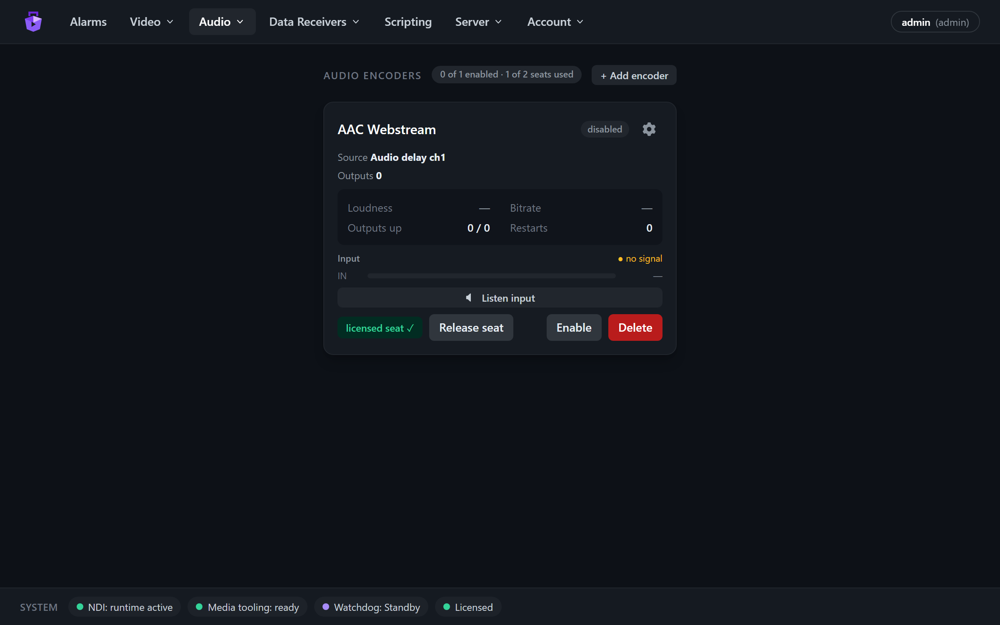

Each card carries a status pill (**disabled** / **running** / **stopped**), the
**Source** (`Audio delay ch{n}` or `NDI · {name}`), the **Outputs** summary,
and a live status strip — **Loudness** (e.g. `−23.1 LUFS · GR 2.4 dB`),
**Bitrate**, **Outputs up** (`{up} / {total}`), **Restarts**. An **Input** panel
shows the level meter, a **● receiving** / **● no signal** indicator, a
**SILENCE** pill and a **Listen input** tap. A licence-seat row reads
**licensed seat ✓** or **unlicensed** with **Assign seat** / **Release seat**,
plus **Disable**/**Enable** and **Delete** (confirm: *"Delete audio encoder
"{name}"? Its outputs stop immediately."*). An unseated encoder shows
**unlicensed · watermarked** (its audio carries periodic watermark tones); on a
redundancy backup it shows **outputs suppressed** — the master carries the
sends so the plant is not double-fed.

### Source and codecs

The cog opens the editor (**Audio encoder — {name}**; **Save config** —
*"Saving restarts a running encoder."*):

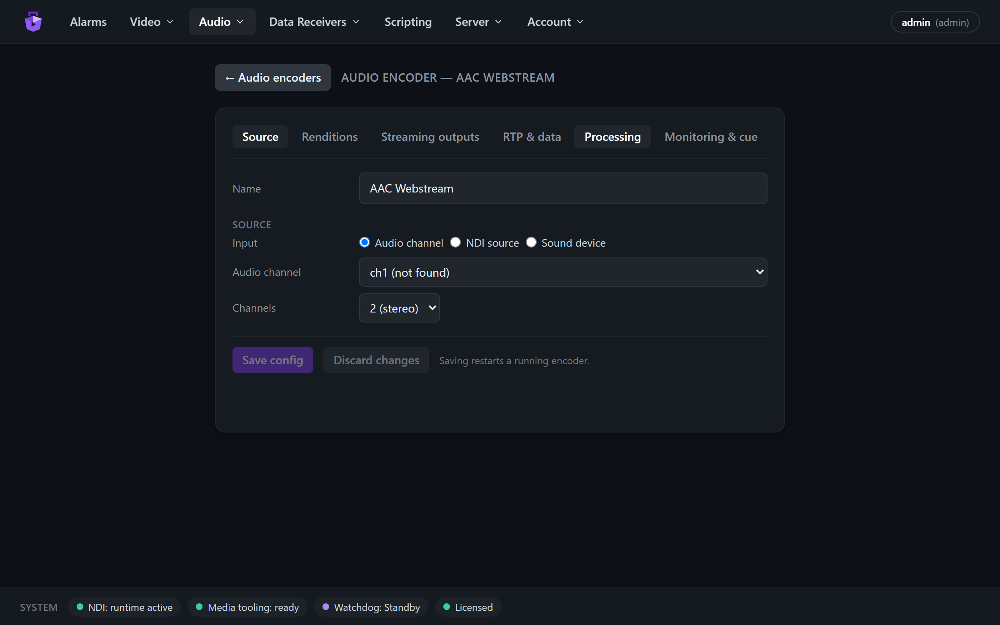

- **Source** — **Input** is an **Audio channel** (pick `ch{n} — {name}`) or an
  **NDI source** (pick from the finder); **Channels** is `1 (mono)` or
  `2 (stereo)` (*HE-AAC v2 renditions need a stereo source*).
- **Renditions** — the AAC encode ladder. Each row picks a profile —
  **AAC-LC**, **HE-AAC v1**, **HE-AAC v2**, or **xHE-AAC** — a sample rate and a
  bitrate. Multiple renditions become the HLS **ABR ladder**. **xHE-AAC (USAC)**
  is **HLS fMP4 only** (64/96 kbps) and needs the **`XHEAAC`** codec licence —
  without it the profile shows but can't be selected.

### Streaming outputs: RTMP, HLS and Icecast

The editor groups one fieldset per output family; each output has a name and an
**enabled** toggle, and secrets are write-only (blank keeps the stored value):

- **RTMP outputs** — a **URL** (`rtmp://host/app`), **Stream key**, optional
  **Username**/**password**, and the **rendition** to publish. (xHE-AAC is
  HLS-only — FLV can't carry USAC.)
- **HLS** — **segment (s)**, **window (segments)**, **program-date-time**, and
  a **container**: **fMP4 (modern)** (CMAF `.m4s` + shared `init.mp4`, best
  player support) or **ADTS (legacy)** raw `.aac` segments. Publish targets are
  **S3**, **SFTP**, **FTP** or **Local file** (bucket/prefix/keys, or
  host/path/credentials, or a directory). An upload failure raises
  `ALARM_AENCODE_HLS`.
- **Icecast / SHOUTcast outputs (MP3 / AAC / Opus)** — **protocol**
  (Icecast/SHOUTcast), **codec** (**MP3** default, **AAC**, or **Opus**),
  bitrate/sample rate, **Host**/**port**/**mount**, source **Username**/
  **password**, and **ICY name**/**genre**/**URL** with a **public directory**
  toggle. Disconnects raise `ALARM_AENCODE_ICECAST`.

### RTP sends and transport

An encoder can also send a raw codec stream over **RTP** to another Airlock (or
any RFC-compliant receiver) — the **RTP sends (point-to-point)** fieldset. Each
send picks a **codec** and a **Destination** (`host` + `port`, optional
`local addr` to bind an interface), plus **TTL**, **MTU** and **payload type**
(`0` = codec default):

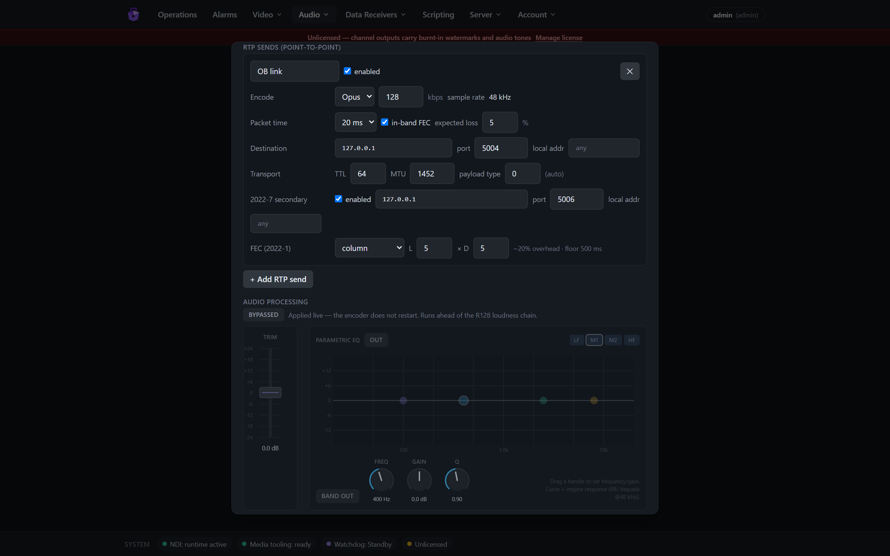

- **Codecs** — **Opus** (RFC 7587), **AAC** (RFC 3640 mpeg4-generic AAC-hbr),
  **MP3** (RFC 2250), or **aptX** (RFC 7310). Opus offers **in-band FEC**
  (LBRR — a low-bitrate copy of each frame rides in the next packet) with an
  **expected loss %**. **aptX** is *aptX-compatible* (Standard aptX only,
  stereo, a fixed 4:1 rate — **352 kbps @44.1 k / 384 kbps @48 k**) and has no
  in-band concealment, so it leans on the packet-loss protection below.
- **2022-7 secondary** — duplicate the stream on a second path (`host`/`port`/
  `local addr`); the decoder merges both legs and rides whichever survives.
- **FEC (2022-1)** — SMPTE 2022-1 XOR forward error correction, **column** or
  **column + row**, sized **L × D**; the row shows the resulting **overhead**
  and recovery **floor** in ms.
- **Multicast** — there is no separate switch: enter a **multicast group
  address** as the destination `host` (and as the decoder's **Listen address**)
  and set an appropriate **TTL** — Airlock joins the group (IGMP) automatically
  on both ends.

### Cues, loudness and monitoring

- **Loudness (EBU R128)** — **loudness normalisation** to a **Target loudness**
  (LUFS) under a **True-peak ceiling** (dBTP).
- **Audio processing** — the same trim/EQ/compressor strip as the channels,
  **In circuit** / **Bypassed**, applied **live** (no encoder restart), ahead
  of the loudness chain, on this encoder's audio only.
- **Monitoring** — **Silence detection** (threshold / hold / hysteresis /
  restore) raises `ALARM_AENCODE_SILENCE` on a dead input.
- **Cues** — a manual **Cue out** / **Cue in** pair on the card marks ad breaks
  (an `ACUE` record, HLS cue tags on the stream); **Cue out** takes a break
  duration in seconds (`0` = open-ended until a **Cue in**). **Auto-cue**
  (editor) fires cues automatically on delay events — **trigger on** `censor or
  dump` / `censor` / `dump` — with a default duration. Scripts can drive cues
  too (`air.AudioEncoderCue`, and the `audioEncoderEvent` trigger — [§12](#12-scripting)).

## 17. Audio decoders and RTP transport

The receive side of RTP audio. A **decoder** listens for an RTP stream — from
an Airlock encoder's RTP send ([§16](#16-audio-streaming-encoders)) or any
RFC-compliant sender — decodes it, and plays it out on a **local audio device**:
a codec return/monitor path between sites. It runs as a supervised child
(`Airlock.AudioDecode`) with its own seat pool, **`ADECODE`**. It is managed
from **Audio → Decoders**, and — unlike the outward emitters — a decoder
**keeps running on a locked redundancy backup** (it only consumes from the
network and drives a local soundcard, a warm monitor feed).

### Playback devices and seats

**Audio → Decoders** lists one card per decoder (**{n} / {total} licence seats
used**; **+ New decoder**). Empty: *"No audio decoders yet."*

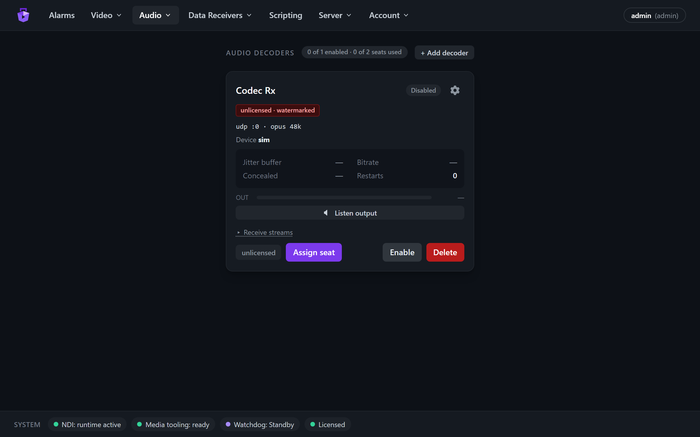

The card shows a state pill — **Playing**, **Prebuffering**, **Starting**,
**StreamLost** or **Disabled** — an info line (`udp :{port}`, ` +2022-7 :{port}`
when a second leg is configured, ` · {codec} {n}k`, ` · fec col+row`), the
**Device** (`{backend} · {name}`), and a status strip: **Jitter buffer**
(`{n} / {n} ms`), **Bitrate**, **Concealed**, **Restarts**. Badges flag trouble
— **DOWN** (child down, `ALARM_ADECODE_DOWN`), **STREAM LOST** (no RTP arriving,
`ALARM_ADECODE_STREAM`), **PATH** (a 2022-7/FEC leg is dead but playout
continues on the survivor, `ALARM_ADECODE_PATH`). The seat/enable/delete row
matches the encoders (delete confirm: *"Delete audio decoder "{name}"? Playout
stops immediately."*); an unseated decoder bursts a watermark tone over its
output.

### The decoder editor

**Audio decoder — {name}**, in four groups (**Save config** — *"Saving restarts
a running decoder."*):

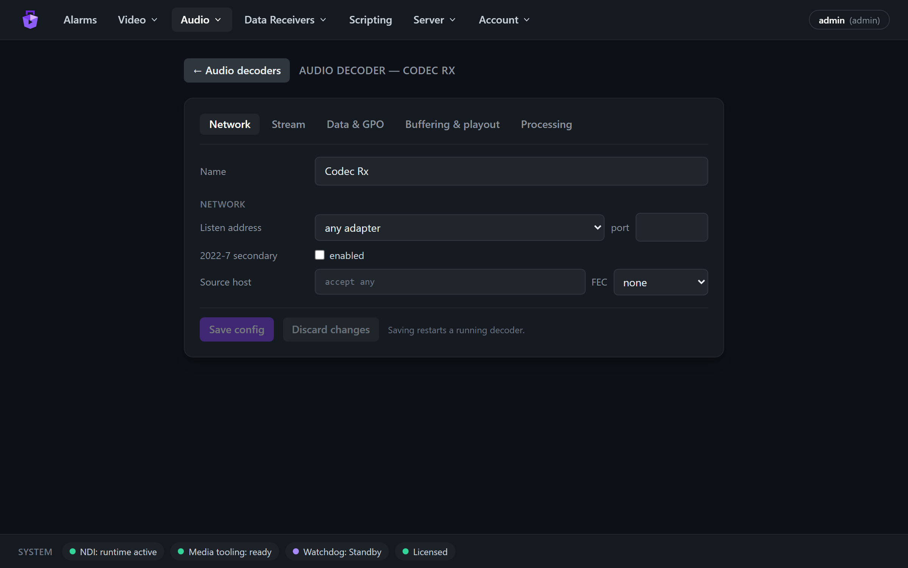

- **Network** — **Listen address** (blank = any; a multicast group joins it),
  **port** (the FEC legs ride ports +2 / +4), the **2022-7 secondary**
  address/port, an optional **Source host** filter, and **FEC** (none / column
  / column + row) to match the sender.
- **Stream** — **Codec** (Opus / AAC / MP3 / aptX), profile, **payload type**
  (`0` = default), **Sample rate**, **channels**, and **packet time** (must
  match the sender's ptime).
- **Buffering** — **Jitter buffer** (ms) and **stream lost after** (ms). With
  FEC the effective jitter target is floored to the sender's matrix span
  (L × D × ptime).
- **Playout** — **Backend** (`sim` / `alsa` / `asio`), the output **device** and
  channel, **Device rate** and **buffer** (frames). An **Audio processing**
  strip runs live on the decoded output ahead of the device.

### Receive-stream diagnostics

Each card expands a **Receive streams** panel — a Tieline-style *Codec Receive
Streams* table (columns **Path · Received · Filtered · Last pkt**) that is the
operator's confidence surface for a resilient receive:

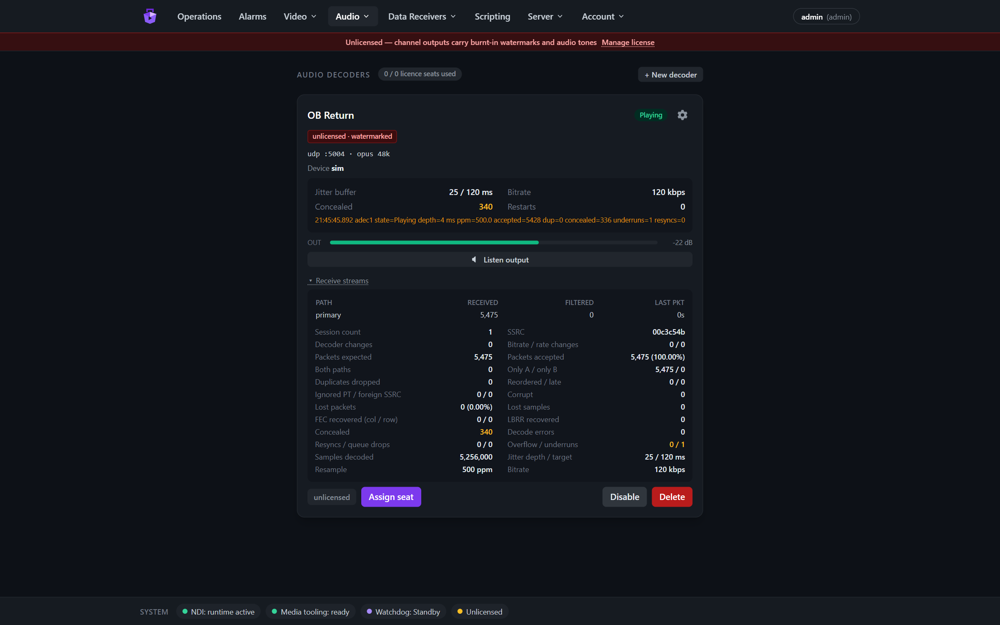

It counts, per path, everything that matters on a lossy or dual-path link —
**Both paths** vs **Only A / only B**, **Duplicates dropped**, **Reordered /
late**, **Lost packets**, **FEC recovered (col / row)**, **LBRR recovered**,
**Concealed**, and the live **Jitter depth / target** — so an operator can see
at a glance whether 2022-7 and FEC are actually earning their overhead.

## 18. Roles and permissions

Roles are hierarchical: **admin ⊇ operator ⊇ viewer**. On a **synced backup**
every operational capability is refused server-side regardless of role
([§13.7](#137-redundancy-primarybackup)).

| Capability | viewer | operator | admin |
|---|:-:|:-:|:-:|
| View dashboard, previews, meters, audit, clips, fills, receivers, GPIO state, licence status | ✔ | ✔ | ✔ |
| Play dump clips / fill previews; change own password | ✔ | ✔ | ✔ |
| Build / Roll out / Dump / Trigger / Censor (video) | | ✔ | ✔ |
| Listen to audio-channel pre/post monitors | ✔ | ✔ | ✔ |
| Audio delay commands and audio config/schedules | | ✔ | ✔ |
| Channel & encoder audio processing (trim/EQ/compressor) | | ✔ | ✔ |
| Enable built-in test pattern; GPI simulate; GPO toggle/override | | ✔ | ✔ |
| Watchdog fail-back (API); redundancy take-over / rejoin | | ✔ | ✔ |
| Channel create/delete/rename, source/fill/delay-mode, enable/disable | | | ✔ |
| Encode config/enable; licence seat assignment | | | ✔ |
| Fill upload/delete; clip delete; alert groups | | | ✔ |
| Server settings, SMTP, LDAP/OIDC, licence activate/deactivate, backup | | | ✔ |
| Redundancy role & sync-key configuration | | | ✔ |
| API clients (create/disable/delete); persistent script variables | | | ✔ |
| LWRP devices/mappings/routing; data receivers/routes | | | ✔ |
| Scripting (the view is hidden below admin) | | | ✔ |
| User management (Server → Users + API) | | | ✔ |

## 19. Alarms and troubleshooting

| Alarm | Meaning | Notes |
|---|---|---|
| `ALARM_SOURCE_LOST` | Input NDI source gone (>500 ms) | Output holds the last good frame and self-paces; `Holds` counter ticks. Clears on source return. |
| `ALARM_NDI_CREATE_FAILED` | The channel's NDI sender could not be created | Usually a sender-name collision — another sender on the network already uses `Airlock <name>` (e.g. a second Airlock instance that hasn't restarted its engine after a rename). Free the name, then disable/enable the channel. |
| `ALARM_ENCODE_DOWN` | Encoder child not running | Supervisor restarts it; programme output unaffected. Check the encoder element (e.g. NVENC on a box without an NVIDIA GPU) in the Encode modal. |
| `ALARM_AV_OFFSET` | Encoder A/V offset beyond ±5 ms | Realignment is automatic; persistent offset warrants investigation. |
| `ALARM_AUDIO_DOWN` | Audio-delay child not running | Supervisor restarts it; check backend/device name in the audio channel's Configure → Device tab. |
| `ALARM_VIDEO_SILENCE` / `ALARM_AUDIO_SILENCE` | Channel input audio stayed below the silence threshold for the hold time | Restores once the level holds above threshold + hysteresis; a fully dead feed reports as source-lost instead. Tune per channel on the Alarms tab ([§5](#5-channel-configuration), [§6.1](#61-alarm-emails-webhooks-and-silence-detection)). |
| `ALARM_SCTE_ABSOLUTE` | An absolute-time (UTC/VITC/GPI) inbound cue arrived after the delay had already outrun its splice moment | Dropped or forwarded per the channel's **SCTE** policy ([§5](#5-channel-configuration)). |
| `ALARM_SCTE_BREAK_ORPHAN` | A return (splice-in) was aired despite a block, to avoid stranding the downstream inside an open ad break | Review the channel's *Block returns* policy and the **Block SCTE** control ([§4](#4-operating-the-delay), [§5](#5-channel-configuration)). |
| `ALARM_SCTE_PREROLL_SHORT` | A cue reached air with less pre-roll than requested | The cue still fires; downstream gets shorter warning than intended. |
| `ALARM_SCTE_IN_SKIP` | An inbound cue could not be placed on the delayed rail | Transient; auto-clears 30 s after the last occurrence. |
| `ALARM_NDI_ENGINE` | The channel's NDI engine faulted | Supervisor recovers it; check the source and network. |
| `ALARM_MEMORY_ADMISSION` | Server memory admission control limited a buffer allocation | Reduce total configured delay depth across channels, or add RAM. |
| `ALARM_AENCODE_DOWN` | Audio streaming-encoder child not running | Supervisor restarts it; check the source and outputs ([§16](#16-audio-streaming-encoders)). |
| `ALARM_AENCODE_RTMP` | An RTMP output disconnected | Check the ingest URL/stream key and the remote server. |
| `ALARM_AENCODE_HLS` | An HLS output is failing to publish | Check the S3/SFTP/FTP/file target and its credentials. |
| `ALARM_AENCODE_ICECAST` | An Icecast/SHOUTcast output disconnected | Check mount, credentials and the remote server. |
| `ALARM_AENCODE_SILENCE` | Audio encoder input silent past the threshold | Check the source channel or NDI feed. |
| `ALARM_ADECODE_DOWN` | Audio decoder child not running | Supervisor restarts it; check the playout device ([§17](#17-audio-decoders-and-rtp-transport)). |
| `ALARM_ADECODE_STREAM` | No RTP stream arriving at the decoder | Check the sender, the network, and the listen port/multicast group. |
| `ALARM_ADECODE_PATH` | A 2022-7 / FEC path is degraded | Playout continues on the surviving leg; investigate the failed path. |
| Ring-full / oversized-metadata alarms | Buffer or metadata limits hit | Buffered content is never overwritten; oversized NDI metadata (>4 KB default) is dropped, not truncated. |

Quick checks, in order: the **footer pills** (NDI runtime present? media
tooling ready? watchdog? licence? redundancy?), the **banners** (licence,
redundancy/lockout), the **alarm strip** on the affected channel card, then
the **Audit table** — every command and state change from every interface is
there, including refusals and their reasons.

---

*Manual generated against Airlock as of 2026-07-16 (main @ a281bde,
AIR-1…190). Screenshots were captured on a live instance using the built-in
colour-bars + tone test source; channel screenshots showing clean (unmarked)
outputs were taken on a seated configuration — an unlicensed server
watermarks every output as described in §14. The Stream Deck plugin
screenshots (§13.9) were supplied from the Elgato Stream Deck app. The
audio-encoder and audio-decoder screenshots (§16, §17) were captured on an
unlicensed evaluation server (no `AENCODE` / `ADECODE` / `XHEAAC` licence), so
they show unlicensed/watermarked states and empty seat pools. A few screenshots
taken in earlier cycles predate the global **Alarms** nav button and the Audio
menu's **Encoders** / **Decoders** entries.*
